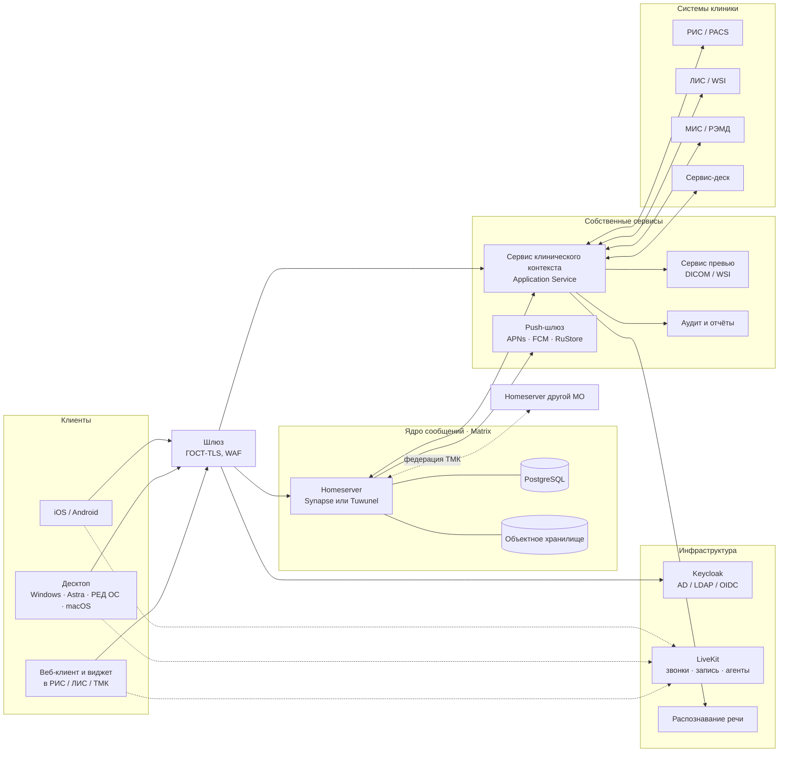

# Концепция: корпоративный медицинский мессенджер «Консилиум»

> «Консилиум» — рабочее название.
> Статус: черновик v0.2 от 07.10.2026, для обсуждения с продуктом, архитектурой, ИБ и юристами. Принятые решения — в разделе 14.

## 0. Коротко

- **Что строим.** Мессенджер с эргономикой Telegram для врачей, лаборантов и инженеров:
  - встраивается в РИС, ЛИС (патоморфология) и телемедицинские системы как виджет;
  - работает отдельными приложениями на ПК (Windows, Astra Linux, РЕД ОС, macOS) и смартфонах (iOS, Android).
- **Главная идея — «чат случая».** У каждого исследования или случая может быть своя комната, связанная с карточкой в РИС/ЛИС:
  - участники подбираются по ролям;
  - над лентой закреплена карточка случая;
  - в ленте — ключевые снимки и ROI препаратов со ссылкой во вьюер, заявки (ИГХ, дорезки, пересмотр), критические находки с подтверждением получения, заключения.
- **Платформа.** **Matrix** (протокол и серверное ядро; согласовано 07.10.2026), **собственные клиенты** на SDK под Apache-2.0 и **собственный сервис клинического контекста**.
  - **Видеосвязь** (согласовано) — LiveKit в контуре организации: звонки, консилиумы, запись. Вход только для участников комнаты. Вебинары на сотни и тысячи зрителей, включая внешних врачей, — в отдельной зоне DMZ через HLS.
  - **ИИ** — первая очередь (согласовано): стенограмма и черновик протокола консилиума на локальных моделях. Работает и без GPU, в режиме «только CPU»; итоги позже ([08-video-ai.md](08-video-ai.md)).
  - **Много обсуждений по разным исследованиям** система выдерживает: комната на случай создаётся лениво, закрытые случаи уходят в архив (раздел 6).
  - **Zulip** — сильный «план Б»: если пилот покажет, что не нужны федерация между организациями, собственные типы сообщений и встроенные звонки.
  - **Mattermost и Rocket.Chat** не рекомендуем. Обоснование — в [02-platforms.md](02-platforms.md).
- **Дизайн.** Корпоративный стиль задаётся токенами: один исходный цвет бренда → все производные оттенки, светлая и тёмная темы. Брендбук пока не получен, поэтому макеты сделаны на нейтральной «клинической» палитре. Замена бренда = замена файла токенов.
- **Соответствие требованиям.** С первого дня проектируем под:
  - 152-ФЗ (здоровье — специальная категория ПДн);
  - 323-ФЗ (врачебная тайна, телемедицина);
  - приказ Минздрава № 193н (действует с 01.09.2025, заменил 965н);
  - требования ФСТЭК (№ 21, № 117);
  - локализацию данных;
  - запрет иностранных мессенджеров для ряда организаций (149-ФЗ, 41-ФЗ).
- **Ориентировочные сроки:**
  - PoC — 6 недель;
  - MVP (веб, встраивание, десктоп) — ещё около 4 месяцев;
  - мобильные клиенты и видеосвязь — около 3 месяцев;
  - затем клинические функции и межорганизационное взаимодействие.
  Ядро команды — 8–10 человек.
- **Макеты.** Интерактивный холст: <https://claude.ai/artifact/HYEy2arBVNpiLeCrpGLvDU>. Он приватный: чтобы показать команде, откройте доступ через «Поделиться». Описание экранов — в [../mockups/README.md](../mockups/README.md).

## 1. Цели и границы

**Цели**

1. Вывести клиническую переписку из личных и иностранных мессенджеров в защищённый контур организации.
2. Сократить путь от находки до действия. Вопрос по исследованию задаётся в его контексте — со снимком и нужными участниками, без пересказа.
3. Встроить коммуникацию в процессы РИС/ЛИС: заявки, статусы, критические находки и консультации фиксируются юридически корректно.
4. Одна система для всех продуктов компании (РИС, ЛИС, ТМК) и всех устройств.

**Не цели первого этапа**

- Переписка с пациентами. Это другой контур, другая модель угроз и другой UX; см. раздел «Риски».
- Ведение медицинской документации в чате. Юридически значимые документы остаются в МИС/РИС/ЛИС, а чат формирует их черновики и ссылается на них.
- Публичный мессенджер.

## 2. Пользователи и роли

| Роль | Задачи в чате | Где работает |
|---|---|---|
| Врач-рентгенолог | Вопросы лаборанту по протоколу, ключевые снимки, критические находки, второе мнение | РИС и вьюер на ПК; дежурства — смартфон |
| Врач-патологоанатом | Заявки ИГХ, дорезки, пересмотр; ROI препаратов; консультации | ЛИС и WSI-вьюер на ПК |
| Лечащий врач (онколог, хирург, терапевт) | Вопросы по результатам, приём критических находок, консилиумы | МИС, смартфон |
| Лаборант (рентгенолаборант, гистолог, лаборант ИГХ) | Уточнения по материалу и протоколу, статусы заявок | Рабочая станция ЛИС/РИС |
| Инженер (медтехника, PACS, ИТ) | Заявки по оборудованию, статусы ремонта | Смартфон, ПК |
| Заведующий отделением | Каналы отделения, контроль сроков, консилиумы | ПК, смартфон |
| Внешний консультант (другая МО) | ТМК врач–врач, второе мнение | Свой сервер (федерация) или гостевой доступ |
| Администратор, специалист ИБ | Политики, аудит, сроки хранения | Консоль администратора |

## 3. Типы бесед

| Тип | Пример | Кто создаёт | Участники | Особенности |
|---|---|---|---|---|
| Личный чат | врач ↔ врач | пользователь | 2 | Сквозное шифрование — по политике |
| **Чат случая** | `Г26-04512`, `A26-118734` | сервис контекста: по событию РИС/ЛИС или по первому сообщению | по ролям из РИС/ЛИС + приглашённые | Карточка случая, структурированные сообщения, автоархив |
| Группа / форум | «Лаборатория ИГХ», «Смена КТ» | заведующий | подразделение (синхронизация с AD или кадровой системой) | Темы — комнаты внутри пространства |
| Врачебный канал | «Отделение патоморфологии» | заведующий | подписчики | Публикуют администраторы; комментарии; отметка «Ознакомлен» |
| Консилиум | «Онкоконсилиум · четверг» | секретарь или заведующий | состав консилиума | Повестка — список чатов случаев; видео; протокол |
| Сервисный чат | «Сканер гистопрепаратов №2» | из чата случая или из карточки оборудования | заявитель + инженеры | Заявка в сервис-деске, статусы, SLA |
| ТМК врач–врач | НМИЦ ↔ региональная МО | по запросу консультации | лечащий врач, консультант, автор исследования | Межорганизационный (федерация); заключение с УКЭП |
| Системный | «ЛИС · уведомления» | интеграция | — | Уведомления и кнопки действий |

## 4. Ключевые сценарии

1. **Ключевой снимок из вьюера.**
   - Рентгенолог в РИС нажимает «В чат исследования».
   - В чат уходит снимок с параметрами: серия, изображение, окно/уровень, разметка.
   - Лечащий врач получает уведомление и одним нажатием открывает тот же кадр в своём вьюере.
   - Макет: «Встраивание в РИС».
2. **Заявка ИГХ.**
   - Патоморфолог в чате случая выбирает «Запрос ИГХ»; заявка создаётся в ЛИС, а в чате появляется карточка со статусом.
   - Лаборант принимает заявку. Статусы «Окраска → Скан → Готово» приходят из ЛИС.
   - Бот присылает миниатюры стёкол.
   - Макеты: «Десктоп», «Мобильный · чат случая».
3. **Критическая находка.**
   - Рентгенолог отправляет «Критическую находку» адресату по роли (например, «дежурный терапевт»).
   - Адресат получает push с высоким приоритетом, без ПДн, и обязан нажать «Подтвердить получение».
   - Нет подтверждения — эскалация: звонок на пост, затем заведующему.
   - Всё пишется в журнал; есть отчёт по времени подтверждения.
   - Макеты: «Встраивание в РИС», «Мобильный · критическая находка».
4. **Проблема с оборудованием.**
   - Из чата случая — «Сообщить инженеру». Открывается сервисный чат по аппарату с приложенным контекстом: аппарат, лог, пример.
   - Создаётся заявка в сервис-деске. Её закрывают inline-кнопками «Решено» / «Повторяется».
   - Макет: «Мобильный · врач — инженер».
5. **Консилиум.**
   - Повестка собирается из чатов случаев.
   - Видеовстреча с демонстрацией вьюера, решение, протокол консилиума в МИС с подписью.
   - Макет: «Видеоконсилиум».
6. **ТМК врач–врач с другой организацией.**
   - Запрос консультации создаёт комнату с участниками из двух организаций (федерация).
   - Обсуждение и снимки, затем заключение консультанта с УКЭП сохраняется в МИС — по порядку приказа № 193н.
7. **Канал отделения.** Объявления, обновления протоколов и шаблонов, графики дежурств — с комментариями и отметкой «Ознакомлен». Макет: «Врачебный канал».
8. **Работа на ходу.** Дежурный получает уведомление без персональных данных, входит по биометрии и отвечает голосом. Сообщение расшифровывается на сервере организации.

## 5. Выбор платформы

Подробное сравнение с источниками — в [02-platforms.md](02-platforms.md).

| Вариант | Вердикт | Главная причина |
|---|---|---|
| **Matrix** (Synapse или Tuwunel) + свои клиенты + сервис контекста | **Рекомендуем** | Комната с метаданными и свои типы событий дают «чат случая» как полноценный объект. Есть Application Service API для интеграций, подтверждения прочтения, федерация для ТМК между организациями. Видеосвязь, запись и ИИ-агенты — LiveKit, связанный с комнатами. Клиентские SDK под Apache-2.0. Прецеденты в здравоохранении: TI-Messenger (gematik, Германия) |
| **Zulip** + свои клиенты | План Б | Apache-2.0 целиком, простая эксплуатация, отличные «темы». Но нет своих типов сообщений и метаданных комнат, права только на уровне канала, нет федерации, звонки только ссылкой |
| Mattermost | Не рекомендуем | В 2022 г. прекратил работу в РФ. Ключевые корпоративные функции платные, а с v11 бесплатная Team Edition ограничена 250 пользователями |
| Rocket.Chat | Не рекомендуем | MongoDB; в Community 0 собственных приложений; E2EE и федерация в бете |
| Российские коробочные (eXpress, VK WorkSpace, Пачка, Compass, TrueConf) | Как интеграции, не как основа | Готовы, часть в реестре и с сертификатами. Но закрыты (кроме Compass под GPL-3.0): нет контроля над UI и моделью «чат случая», нет глубокого встраивания |
| Своя разработка «с нуля» | Не рекомендуем | Синхронизацию, подтверждения, push, поиск, шифрование и федерацию придётся писать самим. Это кратно дороже, а выигрыша почти нет |

**Лицензионная стратегия.** Synapse, Matrix Authentication Service и клиенты Element распространяются под AGPL-3.0. Для включения в реестр российского ПО (ПП № 1236) практики советуют не использовать AGPL в ядре. Поэтому:

- наши компоненты не линкуются с AGPL-кодом и общаются с сервером по открытому протоколу;
- клиенты пишем только на SDK под Apache-2.0;
- сервер — заменяемый компонент: Synapse без доработок или Tuwunel (Apache-2.0, Rust);
- выбор сервера фиксируем в PoC по юридическому заключению.

## 6. Архитектура (обзор)

Подробности, модель данных и потоки — в [03-architecture.md](03-architecture.md).

**Сервис клинического контекста** — сердце решения. Он:

- создаёт чаты случаев и связывает их с РИС/ЛИС;
- синхронизирует участников по ролям и проверяет права по данным РИС/ЛИС;
- превращает действия в чате (заявка ИГХ, сервисная заявка, подтверждение) в операции во внешних системах и обратно;
- ведёт таймеры критических находок и эскалации;
- пишет аудит.

Остальные функции мессенджера — синхронизация, хранение, push — берём из платформы. Видеосвязь, вебинары, запись и ИИ-агенты даёт LiveKit в контуре организации. Matrix хранит состояние звонка в комнате, ССК выдаёт токен на вход только участникам комнаты. Подробности — [03-architecture.md, раздел 7](03-architecture.md#7-видеосвязь-livekit) и [08-video-ai.md](08-video-ai.md).

**Много обсуждений по разным исследованиям.** Система это выдерживает. Модель «комната на случай» даёт много маленьких комнат (3–6 участников), а для Matrix это самый благоприятный профиль нагрузки. Правила:

- комната создаётся лениво — только когда по исследованию действительно пишут (5–15 % исследований);
- создание идемпотентно;
- в комнате только участники по ролям;
- закрытые случаи архивируются, участники из них выводятся. В синхронизации у врача остаются десятки–сотни актуальных комнат, а архив открывается по требованию с полной историей;
- клиенты работают на Sliding Sync.

Оценка: крупная больница — 50–150 новых чатов в сутки, регион — 1,5–2 тыс. Правила, расчёт нагрузки и сценарий нагрузочного теста — в [03-architecture.md, раздел 9](03-architecture.md#9-много-чатов-случаев-подход-и-масштаб).

## 7. Встраивание в РИС, ЛИС и ТМК

Спецификация SDK — в [04-embedding.md](04-embedding.md).

**Режимы**

| Режим | Где | Что показывает |
|---|---|---|
| `panel` | РИС | Панель рядом с вьюером в контексте открытого исследования |
| `launcher` | ЛИС | Плавающая кнопка с бейджем и всплывающий чат над формой случая |
| `headless` | любая система | Без UI: счётчики непрочитанного для рабочих списков, уведомления |
| `full` | любая система | Полноценное приложение |

**Ключевые механики**

- Единый вход (OIDC через Keycloak, общий с РИС/ЛИС).
- Передача контекста: номер исследования или случая, Study Instance UID.
- Команда хоста «прикрепить ключевой снимок / ROI».
- Глубокие ссылки обратно во вьюер: IHE IID или шаблон URL вьюера.
- Тема берётся у хоста.

## 8. Эргономика «как в Telegram»

Подробное соответствие функций — в [05-ux.md](05-ux.md).

**Берём у Telegram:**

- три колонки на десктопе и папки;
- закреплённые чаты;
- пузыри с подтверждениями прочтения;
- ответы, пересылка, редактирование;
- голосовые сообщения;
- форумы с темами и каналы с комментариями;
- inline-кнопки и mini-apps;
- мгновенный старт и офлайн-кэш;
- код-пароль и горячие клавиши.

**Адаптируем под медицину:**

- карточка случая вместо закреплённого сообщения;
- ФИО пациента скрыто, раскрытие пишется в журнал;
- реакции-статусы («Принято», «Согласен», «Видел», «Вопрос», «Срочно») вместо эмодзи;
- критические находки с обязательным подтверждением;
- ролевая адресация («дежурный рентгенолог»), статус смены вместо «был в сети»;
- расшифровка голосовых на сервере организации;
- пересылка из чатов случаев ограничена контуром.

**Не копируем** фирменные элементы Telegram: иконки, обои, логотип, фирменный цвет. Так чище юридически и проще лечь на ваш бренд.

## 9. Дизайн и корпоративный стиль

Описание — в [06-design-system.md](06-design-system.md), токены — в [../design/tokens.json](../design/tokens.json).

**Три уровня токенов:** бренд → семантика → компоненты.

- Из одного цвета бренда формулой выводятся текст ссылок, мягкий фон, фон исходящих, метаданные и тёмная тема. Контраст проверен (≥ 4,5:1).
- Шрифты-заглушки — Golos Text и JetBrains Mono, оба под OFL и с кириллицей. Заменяются корпоративными.
- В режиме встраивания тема берётся у хоста. Для white-label собираются отдельные сборки с вашим названием, иконкой и заставкой.

## 10. Безопасность и соответствие

Подробно — в [07-security-compliance.md](07-security-compliance.md).

- **Всё в контуре клиники или региона.** ПДн и переписка хранятся в РФ. Иностранные облака и сервисы для передачи ПДн не используются.
- **Минимизация ПДн:**
  - ФИО пациента не хранится в чате: отображается замаскированным, а раскрытие запрашивается у РИС/ЛИС и журналируется;
  - push-уведомления не содержат ПДн;
  - превью без «вшитых» демографических данных.
- **Права доступа** берутся из РИС/ЛИС. Есть экстренный доступ («разбить стекло») с указанием причины.
- **Передача данных:**
  - TLS везде; ГОСТ-TLS (сертифицированные СКЗИ) на участках через сети общего пользования;
  - шифрование хранилищ;
  - сквозное шифрование — для личных чатов по политике, но не для чатов случаев: им нужны аудит, поиск и архив.
- **Мобильные клиенты:**
  - обязательный PIN или биометрия, автоблокировка;
  - зашифрованный локальный кэш, удалённый выход;
  - запрет скриншотов в чатах случаев (Android; на iOS — размытие при сворачивании).
- **Аудит:**
  - журналируются просмотры, раскрытия ФИО, экспорт, подтверждения критических находок;
  - выгрузка в SIEM.
- **Юридический статус.** Рабочее обсуждение — не медицинский документ. Формальная консультация по 193н оформляется заключением с УКЭП в МИС (и в РЭМД, если требуется).

## 11. Клиенты и технологии

| Клиент | Технологии | Примечание |
|---|---|---|
| Веб-клиент и виджет | TypeScript, React, matrix-js-sdk (Apache-2.0) | Один код для `full`, `panel`, `launcher`; Web Component + iframe-изоляция |
| Десктоп | Electron (вариант — Tauri) на базе веб-клиента | Windows 10+, Astra Linux, РЕД ОС, Альт, macOS. Трей, автозапуск, deep links, нативные уведомления. ПП № 1937 требует ≥ 2 доверенных ОС |
| iOS / Android | Kotlin и Swift поверх matrix-rust-sdk (FFI-биндинги, Apache-2.0) | Путь, проверенный Element X: офлайн-кэш, Simplified Sliding Sync. Если команда одна — Flutter с мостом к rust SDK (дополнительный риск) |
| Сервер | Synapse или Tuwunel, PostgreSQL, MinIO/Ceph | Kubernetes (Helm) или docker compose / Ansible для малых МО |
| Сервис контекста | Go или Kotlin; HL7 v2 (MLLP), FHIR R4, DICOMweb | Matrix Application Service |
| Видеосвязь | LiveKit on-prem (Apache-2.0): Server + Redis, Egress, Ingress, SIP | Токен от сервиса контекста (только участники комнаты). Свой экран звонка на JS и нативных SDK. Вебинары: сцена на WebRTC, массовая аудитория через HLS. Движок за интерфейсом «провайдер звонков» |
| ИИ | LiveKit Agents; ASR — GigaAM / Whisper; LLM с открытыми весами через OpenAI-совместимый сервер; GPU в контуре | Субтитры, стенограммы с атрибуцией, резюме и черновики протоколов; без внешних облачных API |
| Push | Собственный шлюз (совместим с API Sygnal): APNs, FCM, RuStore Universal Push, HMS | Только `event_id`; содержимое клиент забирает сам |
| Речь | On-prem ASR (например, Vosk или Whisper-совместимая модель) | Медицинский словарь; на сервере организации |

## 12. Дорожная карта (ориентировочно)

| Этап | Длительность | Результат |
|---|---|---|
| 0. Discovery и PoC | 6 недель | Интервью с 3–4 ролями, брендбук, черновик модели угроз, юр. заключение по лицензиям (Synapse или Tuwunel). Прототип: сервер + сервис контекста + веб-виджет в тестовой РИС; LiveKit со входом по токену; стенограмма и резюме тестового консилиума на локальных моделях. Нагрузочный тест: 2000 клиентов, БД с 1 млн комнат случаев, вебинар на 1000 зрителей WebRTC и 5000 HLS. Решение go/no-go по платформе |
| 1. MVP | 14–16 недель | Веб-клиент и SDK встраивания (`panel`, `launcher`, `headless`); десктоп (Windows, Astra). Личные, групповые и чаты случаев с карточкой; ключевые снимки и ROI; заявка ИГХ; папки, поиск, реакции-статусы, файлы. Админка, аудит, вход через AD/Keycloak. Пилот в одном отделении |
| 2. Мобильные и звонки | 10–12 недель | iOS и Android; push без ПДн (APNs, FCM, RuStore); биометрия; голосовые с расшифровкой; видеосвязь на LiveKit: звонки 1:1 с вызовом как в Telegram (CallKit / ConnectionService), видеоконсилиумы с модерацией и лобби, демонстрация экрана; запись по политике |
| 3. Клинические функции | 10–12 недель | Критические находки с эскалацией и отчётами; сервисные заявки и сервис-деск; консилиумы (пространства, повестка, протокол); каналы с «Ознакомлен»; ролевая адресация и дежурства; экспорт переписки в протокол (PDF/A + УКЭП). Вебинары для сотрудников и внешних врачей (зона DMZ: портал с регистрацией, сцена + HLS, вопросы из зала). ИИ первой очереди: стенограмма и черновик протокола консилиума, с профилями «GPU / только CPU» |
| 4. Межорганизационное взаимодействие и сертификация | параллельно, 3–6 мес. | Закрытая федерация между МО (ТМК врач–врач), аттестация ИС, реестр ПО, «доверенное ПО», пентест, отказоустойчивое развёртывание |

**Команда ядра:** продакт-менеджер/аналитик, UX/UI-дизайнер, 2–3 фронтенд-разработчика, 2 мобильных, 2 бэкенд-разработчика (интеграции HL7/FHIR/DICOM), DevOps, QA. На часть времени — специалист ИБ и клинический консультант.

## 13. Риски и открытые вопросы

| Риск / вопрос | Что делаем |
|---|---|
| AGPL (Synapse, MAS) и включение в реестр ПО | Юр. заключение в PoC; изоляция по протоколу; Tuwunel как альтернатива |
| Зрелость Tuwunel для крупных инсталляций | Нагрузочный тест в PoC; Synapse как запасной вариант |
| Функции конференций (лобби, модерация, «поднять руку», роли вебинара) в LiveKit нужно делать самим | Заложено в этап 2 (оценка: плюс 1,5–3 месяца работы команды клиентов); строим на примитивах LiveKit — права в токенах, серверный API |
| Одна комната LiveKit — на одном узле | Большие вебинары: сцена на WebRTC, массовая аудитория — HLS через Egress; лимиты подтверждаем нагрузочным тестом |
| GPU в контуре заказчика есть не всегда | Профили ИИ: GPU / только CPU (итоги через 30–60 мин, без живых субтитров) / внешний ИИ-узел в РФ / выключен — [08-video-ai.md, 5.3](08-video-ai.md#53-профили-ии-gpu-есть-не-всегда) |
| Вебинары для тысяч внешних зрителей: канал и безопасность | Отдельная зона DMZ, HLS через кэширующие узлы или CDN (только контент без ПДн); около 2 Гбит/с на 1000 зрителей при 720p — площадку раздачи выбирать заранее |
| ИИ в медицине: статус медицинского изделия | ИИ только готовит черновики, решает врач; диагностические функции — только зарегистрированные медицинские изделия; статус резюме и стенограмм подтвердить у юристов |
| Медиа WebRTC шифруется не по ГОСТ (DTLS-SRTP) | Межорганизационная видеосвязь — только внутри ЗСПД или VPN с сертифицированным СКЗИ |
| Рост числа чатов случаев за годы | Ленивое создание, архив с выводом участников, удаление по срокам хранения, нагрузочный тест в PoC (см. 03-architecture.md, раздел 9) |
| Доставка push в РФ (FCM нестабилен, RuStore Push требует RuStore) | Universal Push (RuStore + FCM + HMS) и постоянное соединение на корпоративных Android-устройствах |
| Распространение iOS-приложения (в 2026 г. Apple удаляла приложения российских компаний) | Решить, нужен ли iOS на старте; веб-клиент и PWA как запасной путь; MDM |
| Юридический статус переписки и 193н | Разделить «рабочее обсуждение» и «формальную консультацию»; согласовать с юристами |
| Чат с пациентами (ТМК врач–пациент) | Вне MVP. Отдельный контур, вход через ЕСИА; MAX — для уведомлений пациентов через МИС |
| Сквозное шифрование | Только личные чаты и только по политике; чаты случаев — без него ради аудита и архива |

**Что нужно от вас:**

1. Брендбук: цвета, шрифты, логотип, иконки, примеры интерфейсов продуктов.
2. Ответы на вопросы:
   - чьи РИС/ЛИС — собственные продукты или сторонние;
   - какие API уже есть (HL7 v2, FHIR, DICOMweb);
   - масштаб: МО, пользователи, исследования в сутки;
   - модель поставки: on-prem, региональный ЦОД или SaaS.
3. Тестовые стенды РИС/ЛИС и контакты пилотного отделения.
4. Позиция ИБ: класс системы (ГИС или ИСПДн), уровень защищённости, требуемые СКЗИ.

## 14. Журнал решений

| Дата | Решение | Статус |
|---|---|---|
| 07.10.2026 | Matrix — протокол и серверное ядро; собственные клиенты на SDK под Apache-2.0; сервис клинического контекста | Принято (согласовано с заказчиком) |
| 07.10.2026 | ~~Видеосвязь — Jitsi Meet~~ | Пересмотрено: добавились вебинары, запись и ИИ |
| 07.10.2026 | Видеосвязь, вебинары, запись — LiveKit в контуре организации, связанный с комнатами Matrix через сервис контекста; Jitsi — запасной вариант за тем же интерфейсом | Принято (согласовано с заказчиком) |
| 07.10.2026 | Вебинары — сотни и тысячи зрителей, сотрудники и внешние врачи: отдельная зона DMZ (портал, сцена LiveKit, HLS с адаптивным битрейтом); внешние зрители без доступа к клиническому контуру | Принято (требование заказчика); раздача трафика — по площадке |
| 07.10.2026 | ИИ — через ИИ-шлюз с профилями: GPU в контуре / только CPU / внешний ИИ-узел в РФ / выключен (GPU есть не всегда) | Принято (требование заказчика); профиль В — после заключения юристов |
| 07.10.2026 | Первая очередь ИИ — стенограмма и черновик протокола консилиума; ИИ готовит черновик, решает и подписывает врач | Принято (согласовано с заказчиком) |
| 07.10.2026 | Комната на случай или исследование: ленивое идемпотентное создание, участники по ролям, архив с выводом участников и возвратом по требованию | Рекомендовано, проверяется нагрузочным тестом в PoC |
| 07.10.2026 | API интеграции с РИС/ЛИС v1: события CloudEvents от РИС/ЛИС, обратные вызовы в РИС/ЛИС (уровень 2), подключения вместо «типа системы», сторонние системы — через адаптеры HL7 v2 / FHIR в тот же API ([10-integration-api.md](10-integration-api.md)) | Предложено; обсуждается с командой РИС/ЛИС |
| — | Сервер: Synapse или Tuwunel | Решается в PoC после юридического заключения |
