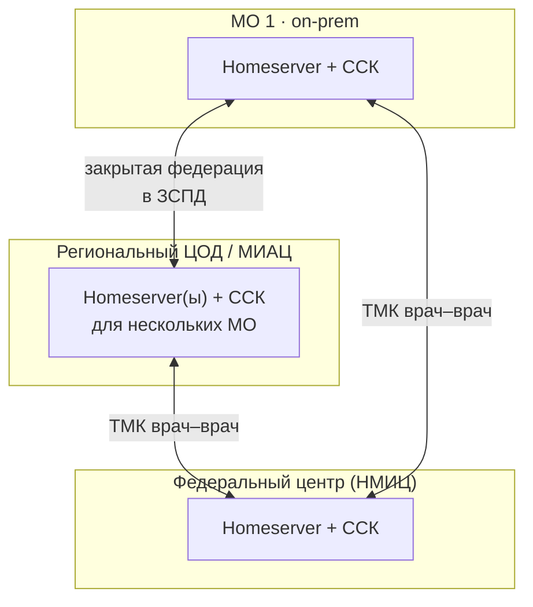
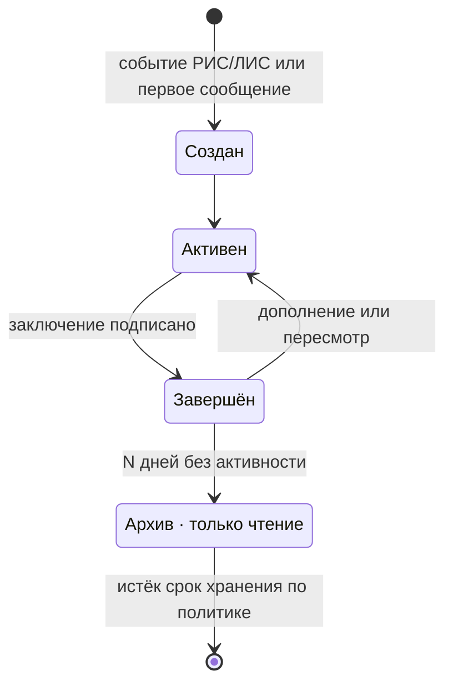
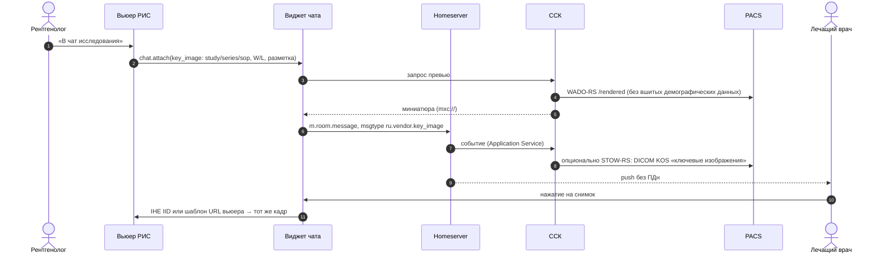
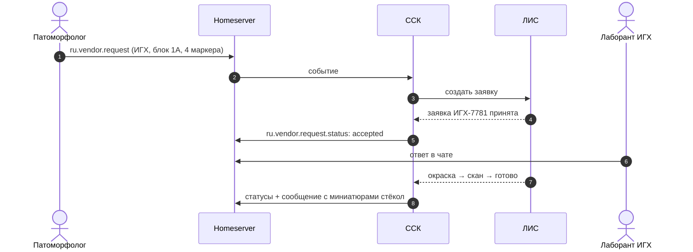
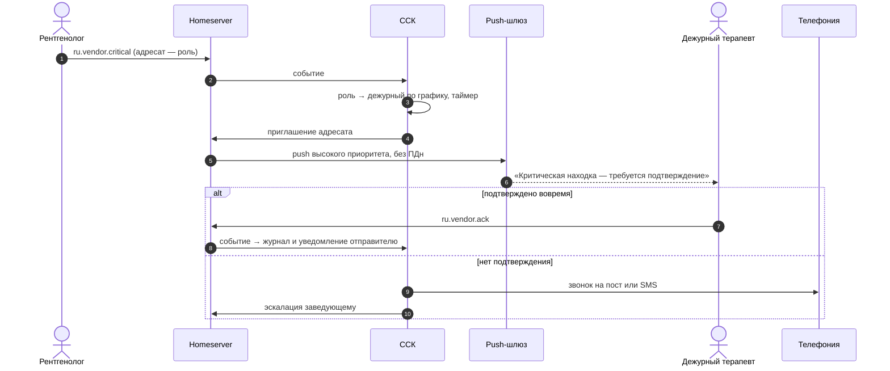

# Архитектура и модель данных

Документ описывает целевую архитектуру для рекомендованного варианта: Matrix, собственные клиенты и сервис клинического контекста.

- Пространство имён событий — `ru.vendor.*`; замените `vendor` на домен компании.
- Идентификаторы в примерах вымышлены.

## 1. Компоненты

| Компонент | Назначение | Технологии |
|---|---|---|
| Клиенты | Веб-клиент и виджет встраивания, десктоп, iOS, Android | TypeScript/React + matrix-js-sdk; Electron; Kotlin/Swift + matrix-rust-sdk |
| Шлюз | TLS-терминация (в т.ч. ГОСТ-TLS), WAF, маршрутизация, лимиты | Angie или nginx + сертифицированное СКЗИ на периметре |
| Homeserver | Хранение и синхронизация событий, комнаты, медиа, федерация | Synapse (+ воркеры) или Tuwunel; PostgreSQL; MinIO/Ceph |
| **Сервис клинического контекста (ССК)** | Чаты случаев, роли, права, карточки, заявки, критические находки, эскалации, аудит | Application Service; Go или Kotlin; PostgreSQL |
| Интеграционные адаптеры | РИС, ЛИС, МИС, PACS, сервис-деск, телефония, кадровая система | HL7 v2 (MLLP), FHIR R4 (REST, Subscriptions), DICOMweb (QIDO/WADO/STOW), REST API продуктов |
| Сервис превью | Миниатюры DICOM (WADO-RS `/rendered`, `/thumbnail`) и WSI-тайлов, удаление «вшитых» демографических данных | Go/Python; OpenSlide или DICOM WSI |
| Push-шлюз | Доставка уведомлений: APNs, FCM, RuStore Universal Push, HMS | Совместим с API Sygnal; содержимое — только `event_id` |
| Аутентификация | Единый вход для РИС/ЛИС/чата; AD/LDAP; при необходимости ЕСИА | Keycloak (OIDC); MAS или OIDC-вход Synapse |
| Звонки | 1:1, групповые, демонстрация экрана | LiveKit SFU + coturn; сигнализация через события комнаты |
| Распознавание речи | Расшифровка голосовых | On-prem ASR с медицинским словарём |
| Поиск | Полнотекстовый поиск с русской морфологией и учётом прав | Встроенный поиск сервера + OpenSearch (индексирует ССК) |
| Аудит и отчёты | Неизменяемый журнал, отчёты (время подтверждения критических находок и т. п.), выгрузка в SIEM | PostgreSQL (append-only) + syslog/CEF |
| Консоль администратора | Пользователи, роли, политики, брендинг, сроки хранения | Веб |

## 2. Варианты развёртывания



| Вариант | Для кого | Особенности |
|---|---|---|
| On-prem в МО | Крупные больницы, онкодиспансеры | Один homeserver на организацию. Kubernetes/Helm или docker compose/Ansible. Серверные ОС: Astra Linux, РЕД ОС |
| Региональный контур | Регион или МИАЦ, сеть МО | Несколько МО на общих серверах, разделение по пространствам и политикам; федерация внутри ЗСПД |
| Облако вендора (SaaS) | Частные клиники и лаборатории | Аттестованный ЦОД в РФ; изоляция арендаторов |

**Федерация только закрытая.** Список разрешённых серверов задаётся (в Synapse — `federation_domain_whitelist`), соединения идут по защищённым каналам.

## 3. Модель данных

### 3.1. Типы комнат

Тип задаётся в `m.room.create` → `content.type`:

| Тип комнаты | `type` | Кто создаёт | Права |
|---|---|---|---|
| Личный чат | — (`m.direct`) | пользователь | 2 участника |
| Группа / тема | — | пользователь, админ | по составу |
| Пространство (отделение, консилиум) | `m.space` | админ, заведующий | дочерние комнаты — темы |
| Врачебный канал | `ru.vendor.channel` | заведующий | пишут только админы; комментарии — тредами |
| **Чат случая** | `ru.vendor.case` | ССК | участники по ролям из РИС/ЛИС |
| Сервисный чат | `ru.vendor.service` | ССК | заявитель + группа инженеров |
| ТМК | `ru.vendor.tmk` | ССК | участники из разных homeserver'ов |

Консилиум — это пространство: его дочерние комнаты (`m.space.child`) — существующие чаты случаев. Обсуждение на консилиуме продолжается в той же комнате случая, а не дублируется.

### 3.2. Контекст случая (state-событие)

```json
{
  "type": "ru.vendor.case.context",
  "state_key": "",
  "content": {
    "source": "LIS",
    "case_id": "Г26-04512",
    "order_id": "Н-2611",
    "accession_number": null,
    "study_instance_uid": null,
    "title": "Биопсия молочной железы, слева",
    "patient": {
      "ref": "pseudo:7f3c9a1e",
      "masked": "Н*** О. В.",
      "age": 54,
      "sex": "F"
    },
    "stage": "ihc",
    "priority": "urgent",
    "due": "2026-10-09T18:00:00+03:00",
    "links": {
      "record": "https://lis.clinic.local/cases/G26-04512",
      "viewer": "https://wsi.clinic.local/case/G26-04512"
    },
    "sync": { "version": 17, "updated_at": "2026-10-06T11:02:13+03:00" }
  }
}
```

**Принцип минимизации ПДн.** В чате нет ФИО, даты рождения и полного номера полиса, только псевдоним (`patient.ref`) и маска.

- Полное ФИО по кнопке «Показать» клиент запрашивает у ССК, а ССК — у РИС/ЛИС с проверкой прав.
- Каждое раскрытие пишется в журнал.

Роли участников хранятся отдельным state-событием на каждого пользователя:

```json
{
  "type": "ru.vendor.case.role",
  "state_key": "@smirnova:clinic.local",
  "content": { "role": "pathologist", "source": "LIS", "assigned_at": "2026-10-06T08:41:00+03:00" }
}
```

Возможные роли: `pathologist`, `radiologist`, `attending`, `lab_tech`, `radiographer`, `engineer`, `head`, `external_consultant`, `on_duty`.

### 3.3. Структурированные сообщения

Все они — `m.room.message` со своим `msgtype` и **обязательным текстовым `body`**. Любой Matrix-клиент покажет хотя бы текст, а наш — карточку.

**Ключевой снимок (РИС/PACS)**

```json
{
  "msgtype": "ru.vendor.key_image",
  "body": "Ключевой снимок: A26-118734, серия 3, изображение 112/356",
  "ru.vendor.key_image": {
    "study_uid": "1.2.643.5.1.13.13.12.2.77.8252.118734",
    "series_uid": "1.2.643.5.1.13.13.12.2.77.8252.118734.3",
    "sop_uid": "1.2.643.5.1.13.13.12.2.77.8252.118734.3.112",
    "frame": 1,
    "presentation": { "ww": 700, "wc": 100, "zoom": 1.4 },
    "annotations": [{ "kind": "ellipse", "points": [[164, 132], [181, 132]], "label": "дефект наполнения" }],
    "thumbnail": "mxc://clinic.local/AbCdEf123",
    "kos_uid": "1.2.643.5.1.13.13.12.2.77.8252.118734.900.1",
    "link": { "kind": "iid", "url": "https://pacs.clinic.local/IHEInvokeImageDisplay?requestType=STUDY&studyUID=…" }
  }
}
```

**ROI препарата (ЛИС, WSI)**

```json
{
  "msgtype": "ru.vendor.slide_roi",
  "body": "Г26-04512 · блок 1Б · стекло 4 · H&E · ×20 · ROI 2",
  "ru.vendor.slide_roi": {
    "slide_id": "G26-04512-1B-4",
    "stain": "H&E",
    "magnification": 20,
    "region": { "x": 51200, "y": 33792, "w": 4096, "h": 2560, "level": 1 },
    "thumbnail": "mxc://clinic.local/RoI2xyz",
    "link": { "kind": "viewer", "url": "https://wsi.clinic.local/slide/G26-04512-1B-4?x=51200&y=33792&z=20" }
  }
}
```

**Заявка** (ИГХ, дорезка, пересмотр, второе мнение, сервисная заявка):

```json
{
  "msgtype": "ru.vendor.request",
  "body": "Запрос ИГХ: блок 1А — ER, PR, HER2/neu, Ki-67 (срочно)",
  "ru.vendor.request": {
    "kind": "ihc",
    "block": "1А",
    "items": ["ER", "PR", "HER2/neu", "Ki-67"],
    "priority": "urgent",
    "note": "HER2 первым",
    "assignee_role": "lab_tech"
  }
}
```

Статусы публикует ССК отдельными событиями со ссылкой на заявку. Клиент показывает последний статус и ход выполнения:

```json
{
  "type": "ru.vendor.request.status",
  "content": {
    "m.relates_to": { "rel_type": "m.reference", "event_id": "$req-7781" },
    "external_id": "ИГХ-7781",
    "status": "staining",
    "steps": ["accepted", "staining", "scanning", "done"],
    "by": "@ershova:clinic.local",
    "source": "LIS"
  }
}
```

**Критическая находка**

```json
{
  "msgtype": "ru.vendor.critical",
  "body": "Критическая находка: двусторонняя ТЭЛА (долевые и сегментарные ветви)",
  "ru.vendor.critical": {
    "finding": "Двусторонняя ТЭЛА: долевые и сегментарные ветви",
    "recipient": { "role": "on_duty:therapy", "resolved_user": "@melnikova:clinic.local" },
    "ack_required": true,
    "ack_deadline": "PT10M",
    "escalation": [
      { "after": "PT10M", "action": "call", "target": "nurse_post:ER" },
      { "after": "PT20M", "action": "notify", "target": "role:head:therapy" }
    ]
  }
}
```

Подтверждение — отдельное событие `ru.vendor.ack` со ссылкой (`m.reference`) на находку. ССК фиксирует в журнале время доставки, прочтения и подтверждения.

**Реакции-статусы** — стандартные `m.reaction` с фиксированными ключами: `принято`, `согласен`, `видел`, `вопрос`, `срочно`. Клиент рисует их иконками.

Прочие типы — по тому же принципу:

- `ru.vendor.report` — заключение: черновик или подписано, ссылка, данные подписи;
- `ru.vendor.incident` — неисправность оборудования;
- `ru.vendor.case.event` — системные события: «исследование выполнено», «заключение подписано».

### 3.4. Жизненный цикл чата случая



- Комната создаётся **лениво** — по первому сообщению или событию (заявка, критическая находка), а не на каждое исследование. Обычно это 5–15 % исследований.
- В архиве комната доступна только на чтение и уходит в папку «Архив».
- Сроки хранения задаёт политика организации.
- Если переписка экспортирована как часть медицинского документа, сроки хранения определяются требованиями к этому документу.

## 4. Права доступа

1. **Источник прав — РИС/ЛИС.** ССК подписан на события назначения: кто направил, кто описывает, кто лаборант, кто консультант. По ним он приглашает и удаляет участников.
2. **Проверка при открытии.** Пользователь открывает виджет, а комнаты ещё нет или его в ней нет. ССК спрашивает у хоста `canAccess(user, case)`; при положительном ответе — вход в комнату.
3. **Экстренный доступ («разбить стекло»).** Пользователь указывает причину, заведующий получает уведомление, событие пишется в журнал.
4. **Снятие назначения** удаляет пользователя из комнаты. История остаётся в журнале аудита.
5. **Пересылка.** Сообщения из чатов случаев пересылаются только в комнаты того же контура; ссылка на случай сохраняется. Экспорт — по праву «экспорт» и с записью в журнал.

## 5. Ключевые потоки

### 5.1. Ключевой снимок из вьюера РИС



### 5.2. Заявка ИГХ



### 5.3. Критическая находка с эскалацией



## 6. Push-уведомления

- В содержимом только `event_id` и `room_id`. Клиент забирает сообщение сам после разблокировки. На экране блокировки — «Новое сообщение в чате случая» или «Критическая находка — требуется подтверждение».
- **Android:** RuStore Universal Push SDK (RuStore + FCM + HMS одним вызовом). На корпоративных устройствах дополнительно — постоянное соединение (foreground service), потому что FCM в РФ работает нестабильно, а RuStore Push требует установленного RuStore.
- **iOS:** APNs; критические находки — с повышенным уровнем прерывания (time-sensitive).
- **Политика «не беспокоить»** учитывает график смен. Критические находки обходят её по правилам организации.

## 7. Поиск

- По тексту:
  - встроенный поиск сервера — для личных чатов;
  - OpenSearch с русской морфологией — для чатов случаев, каналов и групп, где состоит ССК. Индексирует ССК.
- Выдача фильтруется по членству пользователя в комнатах.
- Поиск по пациенту идёт через РИС/ЛИС: пользователь вводит ФИО → ССК получает у хоста список случаев, доступных пользователю → выдаются соответствующие чаты. ФИО в индексе чата не хранится.

## 8. Масштаб (оценка для планирования)

| Сценарий | Пользователи | Исследований в сутки | Новых чатов случаев в сутки | Комнат в год |
|---|---|---|---|---|
| Крупная больница | 2–3 тыс. | 500–1500 | 50–150 | ~20–50 тыс. |
| Регион (общий контур) | 30–50 тыс. | 15–20 тыс. | 1,5–2 тыс. | ~500–700 тыс. |

Для региона — Synapse с воркерами или несколько homeserver'ов, по одному на группу МО, с федерацией. Архивные комнаты выходят из активной синхронизации клиентов: сервер не отдаёт их в Sliding Sync по умолчанию.

## 9. Эксплуатация

- **Мониторинг:** Prometheus и Grafana — задержка доставки, очередь push, ошибки интеграций, время подтверждения критических находок.
- **Логи:** централизованно (Loki или ELK), без ПДн в техническом логе.
- **Резервное копирование:** PostgreSQL (PITR) и объектное хранилище. DR-план с RPO ≤ 15 мин и RTO ≤ 4 ч — уточнить с заказчиком.
- **Обновления:** собственный репозиторий образов, фиксированные версии, регламент проверки upstream-релизов.
