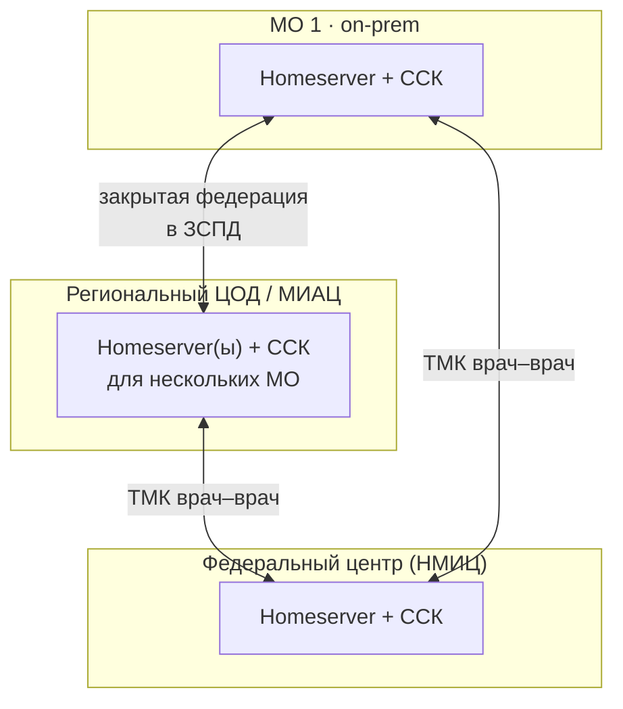
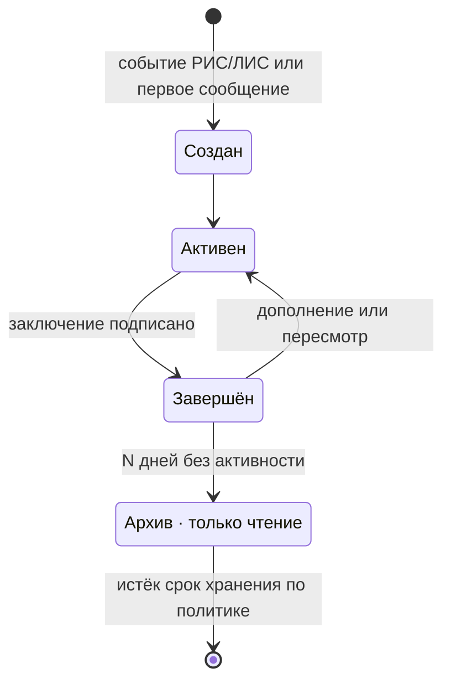
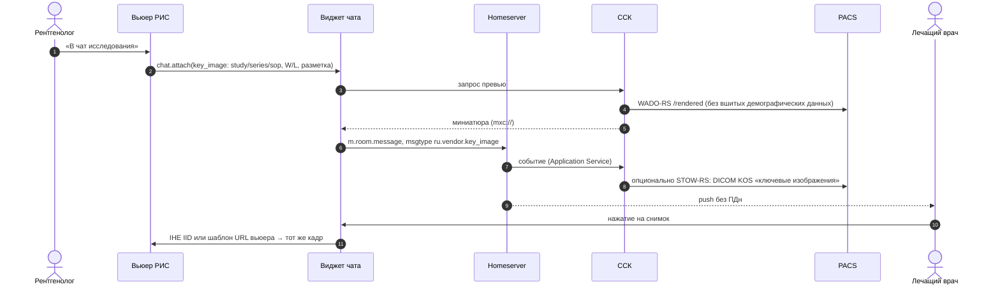
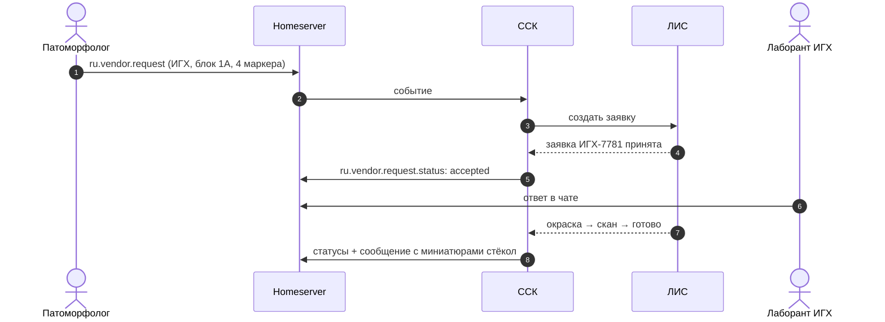
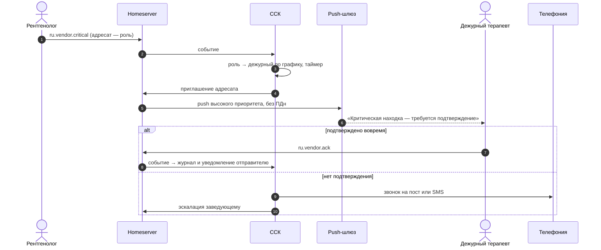

# Архитектура и модель данных

Документ описывает целевую архитектуру для рекомендованного варианта: Matrix, собственные клиенты и сервис клинического контекста.

- Пространство имён событий — `ru.vendor.*`; замените `vendor` на домен компании.
- Идентификаторы в примерах вымышлены.

## 1. Компоненты

| Компонент | Назначение | Технологии |
|---|---|---|
| Клиенты | Веб-клиент и виджет встраивания, десктоп, iOS, Android | TypeScript/React + matrix-js-sdk; Electron; Kotlin/Swift + matrix-rust-sdk |
| Шлюз | TLS-терминация (в т.ч. ГОСТ-TLS), WAF, маршрутизация, лимиты | Angie или nginx + сертифицированное СКЗИ на периметре |
| Homeserver | Хранение и синхронизация событий, комнаты, медиа, федерация | Synapse (+ воркеры) или Tuwunel; PostgreSQL; MinIO/Ceph |
| **Сервис клинического контекста (ССК)** | Чаты случаев, роли, права, карточки, заявки, критические находки, эскалации, аудит | Application Service; Go или Kotlin; PostgreSQL |
| Интеграционные адаптеры | РИС, ЛИС, МИС, PACS, сервис-деск, телефония, кадровая система | HL7 v2 (MLLP), FHIR R4 (REST, Subscriptions), DICOMweb (QIDO/WADO/STOW), REST API продуктов |
| Очередь событий | Буфер событий РИС/ЛИС перед ССК: пики HL7, повторная доставка, идемпотентная обработка | NATS или RabbitMQ |
| Сервис превью | Миниатюры DICOM (WADO-RS `/rendered`, `/thumbnail`) и WSI-тайлов, удаление «вшитых» демографических данных | Go/Python; OpenSlide или DICOM WSI |
| Push-шлюз | Доставка уведомлений: APNs, FCM, RuStore Universal Push, HMS | Совместим с API Sygnal; содержимое — только `event_id` |
| Аутентификация | Единый вход для РИС/ЛИС/чата; AD/LDAP; при необходимости ЕСИА | Keycloak (OIDC); MAS или OIDC-вход Synapse |
| Видеосвязь | Звонки 1:1, видеоконсилиумы, ТМК, вебинары, демонстрация экрана | LiveKit on-prem: Server + Redis, Egress (запись, HLS), Ingress и SIP. Токены выдаёт ССК. Подробнее — раздел 7 и [08-video-ai.md](08-video-ai.md) |
| ИИ-контур | Субтитры, стенограммы, резюме встреч, черновики протоколов, поиск по смыслу | LiveKit Agents; ИИ-шлюз с профилями (GPU / только CPU / внешний узел в РФ); распознавание речи (GigaAM / Whisper); LLM с открытыми весами через OpenAI-совместимый сервер |
| Зона вебинаров (DMZ) | Вебинары для сотрудников и внешних врачей; клинический контур закрыт | Портал (регистрация, плеер, вопросы); отдельный узел LiveKit для сцены; Egress; медиасервер HLS с адаптивным битрейтом; кэширующие узлы или CDN |
| Распознавание речи | Расшифровка голосовых | On-prem ASR с медицинским словарём |
| Поиск | Полнотекстовый поиск с русской морфологией и учётом прав | Встроенный поиск сервера + OpenSearch (индексирует ССК) |
| Аудит и отчёты | Неизменяемый журнал, отчёты (время подтверждения критических находок и т. п.), выгрузка в SIEM | PostgreSQL (append-only) + syslog/CEF |
| Консоль администратора | Пользователи, роли, политики, брендинг, сроки хранения | Веб |

## 2. Варианты развёртывания



| Вариант | Для кого | Особенности |
|---|---|---|
| On-prem в МО | Крупные больницы, онкодиспансеры | Один homeserver на организацию. Kubernetes/Helm или docker compose/Ansible. Серверные ОС: Astra Linux, РЕД ОС |
| Региональный контур | Регион или МИАЦ, сеть МО | Несколько МО на общих серверах, разделение по пространствам и политикам; федерация внутри ЗСПД |
| Облако вендора (SaaS) | Частные клиники и лаборатории | Аттестованный ЦОД в РФ; изоляция арендаторов |

**Федерация только закрытая.** Список разрешённых серверов задаётся (в Synapse — `federation_domain_whitelist`), соединения идут по защищённым каналам.

## 3. Модель данных

### 3.1. Типы комнат

Тип задаётся в `m.room.create` → `content.type`:

| Тип комнаты | `type` | Кто создаёт | Права |
|---|---|---|---|
| Личный чат | — (`m.direct`) | пользователь | 2 участника |
| Группа / тема | — | пользователь, админ | по составу |
| Пространство (отделение, консилиум) | `m.space` | админ, заведующий | дочерние комнаты — темы |
| Врачебный канал | `ru.vendor.channel` | заведующий | пишут только админы; комментарии — тредами |
| **Чат случая** | `ru.vendor.case` | ССК | участники по ролям из РИС/ЛИС |
| Сервисный чат | `ru.vendor.service` | ССК | заявитель + группа инженеров |
| ТМК | `ru.vendor.tmk` | ССК | участники из разных homeserver'ов |

Консилиум — это пространство: его дочерние комнаты (`m.space.child`) — существующие чаты случаев. Обсуждение на консилиуме продолжается в той же комнате случая, а не дублируется.

### 3.2. Контекст случая (state-событие)

```json
{
  "type": "ru.vendor.case.context",
  "state_key": "",
  "content": {
    "source": "LIS",
    "case_id": "Г26-04512",
    "order_id": "Н-2611",
    "accession_number": null,
    "study_instance_uid": null,
    "title": "Биопсия молочной железы, слева",
    "patient": {
      "ref": "pseudo:7f3c9a1e",
      "masked": "Н*** О. В.",
      "age": 54,
      "sex": "F"
    },
    "stage": "ihc",
    "priority": "urgent",
    "due": "2026-10-09T18:00:00+03:00",
    "links": {
      "record": "https://lis.clinic.local/cases/G26-04512",
      "viewer": "https://wsi.clinic.local/case/G26-04512"
    },
    "sync": { "version": 17, "updated_at": "2026-10-06T11:02:13+03:00" }
  }
}
```

**Принцип минимизации ПДн.** В чате нет ФИО, даты рождения и полного номера полиса, только псевдоним (`patient.ref`) и маска.

- Полное ФИО по кнопке «Показать» клиент запрашивает у ССК, а ССК — у РИС/ЛИС с проверкой прав.
- Каждое раскрытие пишется в журнал.

Роли участников хранятся отдельным state-событием на каждого пользователя:

```json
{
  "type": "ru.vendor.case.role",
  "state_key": "@smirnova:clinic.local",
  "content": { "role": "pathologist", "source": "LIS", "assigned_at": "2026-10-06T08:41:00+03:00" }
}
```

Возможные роли: `pathologist`, `radiologist`, `attending`, `lab_tech`, `radiographer`, `engineer`, `head`, `external_consultant`, `on_duty`.

### 3.3. Структурированные сообщения

Все они — `m.room.message` со своим `msgtype` и **обязательным текстовым `body`**. Любой Matrix-клиент покажет хотя бы текст, а наш — карточку.

**Ключевой снимок (РИС/PACS)**

```json
{
  "msgtype": "ru.vendor.key_image",
  "body": "Ключевой снимок: A26-118734, серия 3, изображение 112/356",
  "ru.vendor.key_image": {
    "study_uid": "1.2.643.5.1.13.13.12.2.77.8252.118734",
    "series_uid": "1.2.643.5.1.13.13.12.2.77.8252.118734.3",
    "sop_uid": "1.2.643.5.1.13.13.12.2.77.8252.118734.3.112",
    "frame": 1,
    "presentation": { "ww": 700, "wc": 100, "zoom": 1.4 },
    "annotations": [{ "kind": "ellipse", "points": [[164, 132], [181, 132]], "label": "дефект наполнения" }],
    "thumbnail": "mxc://clinic.local/AbCdEf123",
    "kos_uid": "1.2.643.5.1.13.13.12.2.77.8252.118734.900.1",
    "link": { "kind": "iid", "url": "https://pacs.clinic.local/IHEInvokeImageDisplay?requestType=STUDY&studyUID=…" }
  }
}
```

**ROI препарата (ЛИС, WSI)**

```json
{
  "msgtype": "ru.vendor.slide_roi",
  "body": "Г26-04512 · блок 1Б · стекло 4 · H&E · ×20 · ROI 2",
  "ru.vendor.slide_roi": {
    "slide_id": "G26-04512-1B-4",
    "stain": "H&E",
    "magnification": 20,
    "region": { "x": 51200, "y": 33792, "w": 4096, "h": 2560, "level": 1 },
    "thumbnail": "mxc://clinic.local/RoI2xyz",
    "link": { "kind": "viewer", "url": "https://wsi.clinic.local/slide/G26-04512-1B-4?x=51200&y=33792&z=20" }
  }
}
```

**Заявка** (ИГХ, дорезка, пересмотр, второе мнение, сервисная заявка):

```json
{
  "msgtype": "ru.vendor.request",
  "body": "Запрос ИГХ: блок 1А — ER, PR, HER2/neu, Ki-67 (срочно)",
  "ru.vendor.request": {
    "kind": "ihc",
    "block": "1А",
    "items": ["ER", "PR", "HER2/neu", "Ki-67"],
    "priority": "urgent",
    "note": "HER2 первым",
    "assignee_role": "lab_tech"
  }
}
```

Статусы публикует ССК отдельными событиями со ссылкой на заявку. Клиент показывает последний статус и ход выполнения:

```json
{
  "type": "ru.vendor.request.status",
  "content": {
    "m.relates_to": { "rel_type": "m.reference", "event_id": "$req-7781" },
    "external_id": "ИГХ-7781",
    "status": "staining",
    "steps": ["accepted", "staining", "scanning", "done"],
    "by": "@ershova:clinic.local",
    "source": "LIS"
  }
}
```

**Критическая находка**

```json
{
  "msgtype": "ru.vendor.critical",
  "body": "Критическая находка: двусторонняя ТЭЛА (долевые и сегментарные ветви)",
  "ru.vendor.critical": {
    "finding": "Двусторонняя ТЭЛА: долевые и сегментарные ветви",
    "recipient": { "role": "on_duty:therapy", "resolved_user": "@melnikova:clinic.local" },
    "ack_required": true,
    "ack_deadline": "PT10M",
    "escalation": [
      { "after": "PT10M", "action": "call", "target": "nurse_post:ER" },
      { "after": "PT20M", "action": "notify", "target": "role:head:therapy" }
    ]
  }
}
```

Подтверждение — отдельное событие `ru.vendor.ack` со ссылкой (`m.reference`) на находку. ССК фиксирует в журнале время доставки, прочтения и подтверждения.

**Реакции-статусы** — стандартные `m.reaction` с фиксированными ключами: `принято`, `согласен`, `видел`, `вопрос`, `срочно`. Клиент рисует их иконками.

Прочие типы — по тому же принципу:

- `ru.vendor.report` — заключение: черновик или подписано, ссылка, данные подписи;
- `ru.vendor.incident` — неисправность оборудования;
- `ru.vendor.case.event` — системные события: «исследование выполнено», «заключение подписано».

### 3.4. Жизненный цикл чата случая



- Комната создаётся **лениво** — по первому сообщению или событию (заявка, критическая находка), а не на каждое исследование. Обычно это 5–15 % исследований.
- **В архиве** комната доступна только на чтение, а ССК выводит из неё участников, чтобы у них не копились тысячи комнат. История сохраняется.
- Папка «Архив» в клиенте строится по данным ССК: случаи, где пользователь участвовал. Открытие архивного случая возвращает пользователя в комнату с полной историей; возврат пишется в журнал. Подробнее — раздел 9.
- Сроки хранения задаёт политика организации.
- Если переписка экспортирована как часть медицинского документа, сроки хранения определяются требованиями к этому документу.

## 4. Права доступа

1. **Источник прав — РИС/ЛИС.** ССК подписан на события назначения: кто направил, кто описывает, кто лаборант, кто консультант. По ним он приглашает и удаляет участников.
2. **Проверка при открытии.** Пользователь открывает виджет, а комнаты ещё нет или его в ней нет. ССК спрашивает у хоста `canAccess(user, case)`; при положительном ответе — вход в комнату.
3. **Экстренный доступ («разбить стекло»).** Пользователь указывает причину, заведующий получает уведомление, событие пишется в журнал.
4. **Снятие назначения** удаляет пользователя из комнаты. История остаётся в журнале аудита.
5. **Пересылка.** Сообщения из чатов случаев пересылаются только в комнаты того же контура; ссылка на случай сохраняется. Экспорт — по праву «экспорт» и с записью в журнал.

## 5. Ключевые потоки

### 5.1. Ключевой снимок из вьюера РИС



### 5.2. Заявка ИГХ



### 5.3. Критическая находка с эскалацией



## 6. Push-уведомления

- В содержимом только `event_id` и `room_id`. Клиент забирает сообщение сам после разблокировки. На экране блокировки — «Новое сообщение в чате случая» или «Критическая находка — требуется подтверждение».
- **Android:** RuStore Universal Push SDK (RuStore + FCM + HMS одним вызовом). На корпоративных устройствах дополнительно — постоянное соединение (foreground service), потому что FCM в РФ работает нестабильно, а RuStore Push требует установленного RuStore.
- **iOS:** APNs; критические находки — с повышенным уровнем прерывания (time-sensitive).
- **Политика «не беспокоить»** учитывает график смен. Критические находки обходят её по правилам организации.

## 7. Видеосвязь (LiveKit)

**Решение (рекомендация от 07.10.2026):** LiveKit в контуре организации (Apache-2.0) — единая медиаплатформа для звонков 1:1, видеоконсилиумов, ТМК и вебинаров. Сюда же входят запись (Egress), приём внешних потоков и SIP (Ingress, SIP-сервис), ИИ-агенты (Agents). Сравнение с Jitsi, вебинары, запись и ИИ — в [08-video-ai.md](08-video-ai.md).

Matrix отвечает за то, кто и куда звонит, за права и за след звонка в истории чата. LiveKit отвечает за медиапотоки.

### 7.1. Как связаны Matrix и LiveKit

- **Состояние звонка** хранится в комнате: state-событие `ru.vendor.call` с полями `call_id`, тип (`direct`, `consilium`, `tmk`, `webinar`), кто и когда начал.
  - Все клиенты видят плашку «Идёт видеоконсилиум — присоединиться».
  - В ленте остаются «Звонок начат / завершён» и пропущенные звонки.
- **Вход — по токену LiveKit от ССК.** ССК проверяет членство пользователя в комнате Matrix и его роль. Права записаны в токене: публикация, демонстрация экрана, модерация, «только просмотр» для зрителей вебинара. Анонимного входа нет. Имя комнаты LiveKit непредсказуемо: `HMAC(room_id, call_id)`.
- **Участники из другой МО** (ТМК по федерации) получают токен от ССК организации, где идёт звонок, после той же проверки. Для них — лобби: токен «только ожидание», пока модератор не впустит.
- **Модерация** через серверный API LiveKit по команде ССК: выключить микрофон, удалить участника, вызвать на сцену.

### 7.2. Звонок 1:1 «как в Telegram»

1. Звонящий отправляет в комнату событие `ru.vendor.call.invite`.
2. Push-шлюз шлёт вызов с высоким приоритетом:
   - iOS — VoIP push и CallKit;
   - Android — полноэкранное уведомление и ConnectionService.
3. Принял — оба входят в комнату LiveKit.
4. Не ответил — в чате остаётся «Пропущенный звонок».

### 7.3. Клиенты

- **Веб, встраивание, десктоп** — LiveKit JS SDK; экран звонка полностью наш.
- **Мобильные** — нативные SDK (Swift, Kotlin); экран звонка и консилиума как в макетах.
- **Демонстрация экрана** — с повышенным разрешением и низкой частотой кадров. Для диагностики этого мало, поэтому на этапе 3 — **синхронный просмотр**: ведущий транслирует состояние вьюера, а вьюер каждого участника повторяет его в полном качестве.

### 7.4. Безопасность

- **Шифрование медиа.** WebRTC шифрует медиа по DTLS-SRTP — это не ГОСТ.
  - Внутри контура МО — по модели угроз.
  - Между организациями через сети общего пользования — только внутри ЗСПД или VPN с сертифицированным СКЗИ.
- **TURN** — только свой (встроенный TURN LiveKit или coturn), без внешних STUN/TURN.
- **Запись и распознавание речи** выключены по умолчанию. Включаются политикой; все участники видят индикатор.

### 7.5. Эксплуатация

- LiveKit Server (Go) + Redis для нескольких узлов. Комнаты распределяются по узлам, но **одна комната целиком живёт на одном узле**. Поэтому большие вебинары раздаются через HLS — см. [08-video-ai.md](08-video-ai.md#42-вебинары).
- Egress — отдельные экземпляры (≥ 4 ядра и 4 ГБ на каждый). Agents — отдельные процессы, для распознавания речи и LLM — GPU-серверы.
- Сайзинг — по нагрузочному тесту в PoC.

## 8. Поиск

- По тексту:
  - встроенный поиск сервера — для личных чатов;
  - OpenSearch с русской морфологией — для чатов случаев, каналов и групп, где состоит ССК. Индексирует ССК.
- Выдача фильтруется по членству пользователя в комнатах.
- Поиск по пациенту идёт через РИС/ЛИС: пользователь вводит ФИО → ССК получает у хоста список случаев, доступных пользователю → выдаются соответствующие чаты. ФИО в индексе чата не хранится.

## 9. Много чатов случаев: подход и масштаб

**Короткий ответ:** выдержит при правильной модели. Само число комнат для Matrix не проблема: на сервере это строки в PostgreSQL. Нагрузку создают три другие вещи:

1. огромные комнаты с тысячами участников и частой сменой состава;
2. пользователь, состоящий в тысячах комнат сразу, — тяжёлая синхронизация клиента;
3. пространства с десятками тысяч дочерних комнат — огромное состояние.

Модель «комната на случай» даёт много маленьких комнат по 3–6 участников — самый благоприятный для Matrix профиль. Остальные риски снимают правила ниже.

### 9.1. Правила

| # | Правило | Зачем |
|---|---|---|
| 1 | Одна комната — один случай ЛИС или одно исследование РИС. Исследования одного заказа (например, КТ груди и живота за визит) — одна комната, если РИС группирует их в заказ. Прошлые исследования пациента — ссылками на их комнаты, без слияния | Чёткий контекст и права |
| 2 | Комната создаётся лениво: по первому сообщению или событию (заявка, критическая находка, запрос консультации) | Комнаты есть у 5–15 % исследований, а не у всех |
| 3 | Создание идемпотентно: ключ «организация + система + номер случая» уникален в БД ССК; у комнаты служебный псевдоним `#c-<HMAC(ключа)>:сервер` | Два одновременных «первых» сообщения не создадут две комнаты; номер исследования не виден в псевдониме |
| 4 | При создании в комнату входят только участники по ролям: направивший, описывающий врач, лаборант этапа. Остальные — по требованию: открыл случай в РИС/ЛИС → проверка прав → вход | Маленький состав, меньше уведомлений |
| 5 | Закрытый случай через N дней без активности архивируется: только чтение, участники выводятся, история сохраняется (`history_visibility: shared`). Открыл архивный случай — ССК возвращает пользователя в комнату с полной историей | В синхронизации у врача только актуальное: десятки–сотни комнат, а не десятки тысяч за годы |
| 6 | Папки «Случаи», «Лаборатория» и т. п. клиент строит по типу комнаты и контексту случая. Пространства — только для небольших наборов, например консилиума на дату (5–15 случаев) | Нет «гигантских» пространств с тысячами дочерних комнат |
| 7 | Клиенты работают на Simplified Sliding Sync: сервер отдаёт только видимое окно списка и счётчики, ленты подгружаются при открытии. Бейджи в рабочем списке РИС — подписка на комнаты конкретных строк (`room_subscriptions`) | Быстрый старт при любом числе комнат |
| 8 | События РИС/ЛИС идут через очередь, ССК обрабатывает их идемпотентно. События по случаям без комнаты только обновляют сопоставление и комнат не создают | Пики HL7 не бьют по серверу сообщений |
| 9 | По истечении срока хранения комнаты удаляются через Admin API, кроме попавших под юридическое удержание | БД не растёт бесконечно |
| 10 | Исправления в РИС/ЛИС (слияние пациентов, перепривязка исследования) пересчитывают контекст и права. При смене пациента комната «замораживается», создаётся новая, событие пишется в журнал | Клиническая безопасность: обсуждение не уходит к чужому пациенту |

**Почему не «одна комната отделения с тредами по случаям».** Права в Matrix задаются на комнату: каждый в отделении видел бы все случаи. Комната получилась бы огромной и шумной. Отделение — это канал или группа; случай — своя комната.

### 9.2. Сервер

- **Synapse:**
  - воркеры синхронизации;
  - несколько процессов записи событий (запись шардируется по комнатам);
  - отдельные воркеры медиа, push и федерации.
- **Сервисный пользователь ССК** создаёт комнаты без ограничений частоты (`rate_limited: false` в регистрации Application Service).
- **PostgreSQL:** отдельный кластер, PITR, мониторинг роста таблиц состояний, периодическое сжатие состояний (synapse_auto_compressor).
- **Регион:** несколько homeserver'ов по группам МО с федерацией — нагрузка и отказы делятся горизонтально.
- **Tuwunel,** если выбран, проходит тот же нагрузочный тест; для регионального масштаба — разделение по серверам.

### 9.3. Оценка нагрузки для планирования

Допущение: обсуждение есть у 10 % исследований.

| Показатель | Крупная больница | Регион (общий контур) |
|---|---|---|
| Пользователи / одновременно онлайн | 2–3 тыс. / 0,5–1 тыс. | 30–50 тыс. / 8–15 тыс. |
| Исследований и случаев в сутки | 500–1500 | 15–20 тыс. |
| Новых чатов случаев в сутки | 50–150 | 1,5–2 тыс. |
| Сообщений в сутки во всех чатах | 2–6 тыс. | 50–100 тыс. (около 1 в секунду в среднем) |
| Активных комнат у одного врача | 30–200 | 30–200 |
| Комнат в БД за 5 лет (до удаления по срокам) | 100–270 тыс. | 2,7–3,7 млн |

Поток сообщений здесь невелик. Главная нагрузка — тысячи одновременных подключений синхронизации, и она масштабируется воркерами. Миллионы строк о комнатах для PostgreSQL — штатный объём.

### 9.4. Проверка в PoC

- **Синтетическая БД:** 1 млн комнат случаев по 3–6 участников и 10–30 сообщений, 50 тыс. пользователей.
- **Нагрузка:**
  - 2000 одновременных клиентов на Sliding Sync, у каждого 200 активных комнат;
  - пик создания — 5 комнат в секунду в течение часа.
- **Целевые значения (p95):**
  - создание комнаты — ≤ 1 с;
  - доставка сообщения — ≤ 300 мс;
  - холодный старт клиента — ≤ 1,5 с;
  - возврат в архивную комнату с историей — ≤ 1 с.

## 10. Эксплуатация

- **Мониторинг:** Prometheus и Grafana — задержка доставки, очередь push, ошибки интеграций, время подтверждения критических находок.
- **Логи:** централизованно (Loki или ELK), без ПДн в техническом логе.
- **Резервное копирование:** PostgreSQL (PITR) и объектное хранилище. DR-план с RPO ≤ 15 мин и RTO ≤ 4 ч — уточнить с заказчиком.
- **Обновления:** собственный репозиторий образов, фиксированные версии, регламент проверки upstream-релизов.
