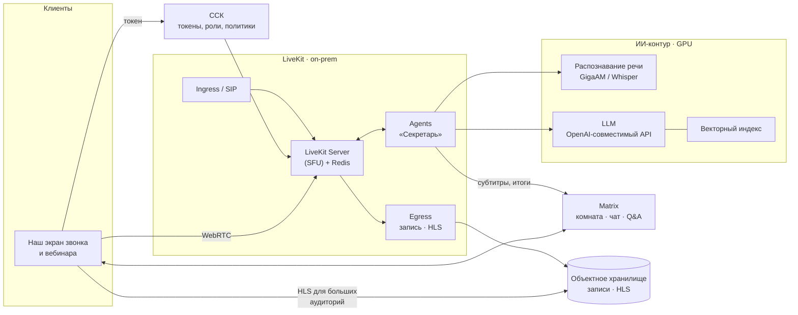
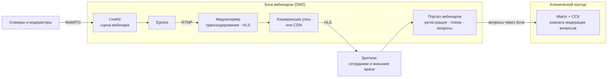

# Видеосвязь, вебинары, запись и ИИ

> Версия от 07.10.2026. **LiveKit принят** (согласовано с заказчиком 07.10.2026) вместо предварительной рекомендации Jitsi.
>
> Уточнения заказчика:
> - вебинары — на сотни и тысячи зрителей, сотрудники и внешние врачи (раздел 4.2);
> - серверы с GPU в контуре есть не всегда (раздел 5.3);
> - первая очередь ИИ — стенограмма и черновик протокола консилиума (раздел 5.4).
>
> Факты — по документации и публикациям проектов (ссылки в конце). Цифры производительности и сайзинга нужно подтвердить нагрузочным тестом в PoC.

## 1. Требования

1. Звонки 1:1 «как в Telegram»: вызов через push, системный экран звонка.
2. Видеоконсилиумы и ТМК: 3–20 участников, демонстрация вьюера, участники из других МО.
3. **Большие вебинары:** от сотен до тысяч зрителей — сотрудники и внешние врачи; вопросы из зала, «вызов на сцену».
4. **Запись** встреч и вебинаров по политике.
5. **Распознавание речи:** субтитры в реальном времени и стенограмма с указанием, кто говорит.
6. **ИИ:** резюме встречи, черновик протокола консилиума, поручения; дальше — другие функции (раздел 6).
7. Всё в контуре организации (152-ФЗ, локализация), свой интерфейс в стиле продукта.

## 2. Jitsi и LiveKit: сравнение

| Критерий | Jitsi Meet | LiveKit |
|---|---|---|
| Что это | Готовое приложение видеоконференций | Платформа реального времени: медиасервер + SDK + сервисы записи, трансляций и ИИ-агентов |
| Лицензия | Apache-2.0 (Prosody — MIT) | Apache-2.0: сервер, SDK, Egress, Ingress, SIP, Agents |
| Свой интерфейс на вебе и десктопе | IFrame API: свои кнопки поверх интерфейса Jitsi | SDK и готовые компоненты: полностью свой интерфейс |
| Свой интерфейс на мобильных | Jitsi Meet SDK (внутри React Native), настраивается частично | Нативные SDK (Swift, Kotlin, а также Flutter, React Native): полностью свой экран звонка |
| Функции конференций из коробки | Лобби, модерация, «поднять руку», сессионные залы | Есть примитивы (права в токенах, серверный API модерации, атрибуты участников); сами функции — наша разработка |
| Большие встречи | Режим «зрителей» (visitors): команда Jitsi показывала 10 000 участников — это требует отдельной настройки серверов | Одна комната — один узел. Официальный тест: 10 спикеров и 3000 слушателей (аудио) на 16 ядрах. Для тысяч зрителей — трансляция HLS через Egress (раздел 4) |
| Запись | Jibri: одна запись на экземпляр, каждый — отдельная VM с Chrome | Egress: запись всей комнаты (через Chrome) или отдельных дорожек без перекодирования — сотни заданий на экземпляр. Форматы: MP4, HLS, RTMP; хранилище S3-совместимое |
| Трансляции | Jibri → RTMP | Egress → HLS / RTMP; Ingress — приём внешнего потока (RTMP, WHIP) в комнату |
| Распознавание речи | Jigasi + Skynet (Faster Whisper) или Vosk | Agents: агент получает дорожку каждого участника, ASR подключается плагином или через OpenAI-совместимый API |
| ИИ-функции | Skynet: локальные резюме встреч; остальное — своя разработка | Agents — фреймворк для ИИ-участников: субтитры, резюме, ассистенты, голосовые агенты; модели любые, в т.ч. локальные |
| Кто говорит | Jigasi транскрибирует участников раздельно; запись Jibri — смешанная | Отдельная дорожка на каждого участника: атрибуция без диаризации, и в живом режиме, и в записи |
| Телефония / ВКС | Jigasi (SIP) | SIP-сервис |
| Связь с Matrix | Через наш сервис (JWT) | То же; плюс MatrixRTC и Element Call построены на LiveKit — путь к совместимости с другими Matrix-клиентами |
| Эксплуатация | Prosody, Jicofo, Videobridge (+ Jibri на каждую запись, Jigasi) | Сервер на Go + Redis; Egress (≥ 4 ядра / 4 ГБ на экземпляр), Ingress, SIP, Agents; GPU — для ИИ |
| До первого видеоконсилиума | Быстрее | Дольше: функции конференций делаем сами (оценка — плюс 1,5–3 месяца работы команды клиентов) |

## 3. Вывод

**Решение: LiveKit (принято 07.10.2026).** LiveKit универсальнее: Jitsi — хорошее готовое приложение для совещаний, а LiveKit — платформа, на которой мы строим всё сами: звонки, консилиумы, вебинары, запись и ИИ. Для набора требований из раздела 1 это решает четыре вещи:

1. **ИИ.** Агент — полноценный участник комнаты с отдельной дорожкой каждого говорящего. Субтитры, стенограмма с атрибуцией и резюме строятся на одном механизме.
2. **Запись.** Дорожки записываются без перекодирования, сотни заданий на экземпляр. В Jitsi на каждую одновременную запись нужна отдельная VM с Chrome.
3. **Интерфейс.** Нативные SDK дают свой экран звонка и консилиума, как в макетах. Jitsi на мобильных — это «Jitsi в наших цветах».
4. **Matrix.** Звонки в экосистеме Matrix (MatrixRTC, Element Call) построены на LiveKit.

**Цена решения.** Лобби, модерацию, «поднять руку», роли вебинара и сессионные залы делаем сами из готовых примитивов LiveKit. Это дольше, чем включить Jitsi. Но видеосвязь — этап 2, и время на это в плане есть.

**Jitsi** остаётся запасным вариантом за тем же интерфейсом «провайдер звонков».

## 4. Архитектура

### 4.1. Звонки и консилиумы

- **Состояние звонка** хранится в комнате Matrix (`ru.vendor.call`). Все клиенты видят «Идёт видеоконсилиум — присоединиться», в ленте остаются начатые, завершённые и пропущенные звонки.
- **Вход — по токену LiveKit**, который выдаёт ССК только участникам комнаты Matrix. Права задаются в токене: публикация видео и аудио, демонстрация экрана, модератор. Анонимного входа нет.
- **Звонок 1:1:**
  - событие `ru.vendor.call.invite`;
  - push с высоким приоритетом (iOS — VoIP push и CallKit, Android — полноэкранное уведомление и ConnectionService);
  - принятие → оба входят в комнату LiveKit.
- **Модерация** — серверный API LiveKit через ССК: выключить микрофон, удалить участника, изменить права. Лобби — токен «только ожидание» до одобрения модератором.
- **Синхронный просмотр снимков** (этап 3): ведущий транслирует состояние вьюера (серия, срез, окно/уровень или координаты WSI) через канал данных LiveKit или события Matrix. Вьюер каждого участника повторяет его в диагностическом качестве — демонстрация экрана для диагностики не годится.

### 4.2. Вебинары для сотрудников и внешних врачей

Аудитория — сотни и тысячи зрителей, в том числе внешние врачи. Клинический контур при этом должен оставаться закрытым, поэтому вебинары вынесены в отдельную зону.

| Зона | Что в ней | Кто заходит |
|---|---|---|
| Клинический контур | Matrix, чаты случаев, LiveKit для звонков и консилиумов | Только сотрудники и участники закрытой федерации |
| Зона вебинаров (DMZ) | Портал вебинаров, отдельный узел LiveKit для сцены, Egress, медиасервер HLS, кэширующие узлы | Сотрудники и внешние зрители |

Внешние зрители не получают учётных записей в клиническом Matrix и не видят чатов.

**Доставка**

| Кто | Как | Задержка | Интерактив |
|---|---|---|---|
| Сцена: спикеры, модераторы, приглашённые внешние спикеры | WebRTC на узле вебинаров. Внешний спикер получает разовый токен и проходит лобби | < 0,5 с | Полный |
| Интерактивные зрители: сотни; до 1–3 тыс. — если подтвердит нагрузочный тест | WebRTC, токен «только просмотр» | < 0,5 с | Вопросы, «поднять руку», вызов на сцену |
| Массовая аудитория: тысячи | HLS с адаптивным битрейтом: Egress → RTMP → медиасервер (1080p / 720p / 480p / только звук) → кэширующие узлы или CDN; плеер на портале и в наших клиентах | несколько секунд | Вопросы через портал |

**Пропускная способность** (оценка для планирования):

- 1000 зрителей при ~2 Мбит/с (720p) — около 2 Гбит/с исходящего трафика;
- 3000 зрителей — около 6 Гбит/с.

Это больше типичного внешнего канала больницы. Варианты раздачи:

1. Площадка с нужной полосой — ЦОД вендора или региона.
2. Российский CDN — только для контента без ПДн и по договору.
3. Собственные кэширующие узлы у провайдера.

Выбор — по месту проведения и аудитории.

**Регистрация и доступ**

- **Сотрудники** — единый вход (Keycloak).
- **Внешние врачи** — регистрация на портале: e-mail или телефон с одноразовым кодом, организация, специальность.
  - Если нужна подтверждённая личность (например, для учёта НМО), возможен вход через ЕСИА — оценить отдельно.
- **Ссылка-приглашение** персональная. Одновременно с одного аккаунта — не больше одного просмотра.

**Вопросы из зала**

- Зритель пишет вопрос на портале; ССК через бота передаёт его в комнату модерации вебинара в Matrix.
- Модераторы отбирают вопросы, ИИ группирует похожие.
- Ответы и отобранные вопросы показываются на портале.

**Содержание.** Клинические случаи на вебинарах — только обезличенные: без ФИО, дат и номеров исследований, снимки без «вшитых» данных. Обезличивание проверяется перед эфиром.

**Отчёт о присутствии** — время подключения, длительность, ответы на контрольные вопросы. Нужен для внутренней отчётности и НМО; интеграция с порталом НМО — отдельная задача.

**Запись вебинара** — MP4 и HLS. Публикуется на портале по решению организатора; после эфира ИИ делает оглавление и конспект.

### 4.3. Запись

- **По умолчанию выключена.** Включается политикой (консилиум, вебинар) с явным индикатором у всех участников и уведомлением при входе.
- **Два вида записи:**
  - запись всей комнаты (MP4) — для просмотра;
  - отдельные аудиодорожки участников — для стенограммы и поиска. Дорожки пишутся без перекодирования, поэтому дёшевы.
- **Хранение:** объектное хранилище в контуре, сроки хранения по политике, доступ по правам комнаты, аудит просмотров и скачиваний.

## 5. Распознавание речи и ИИ-резюме

### 5.1. Как работает «Секретарь»

1. Включили «Стенограмму» в консилиуме → ССК запускает агента LiveKit. Он входит в комнату как видимый участник «Секретарь (запись речи)».
2. Агент подписывается на аудиодорожку каждого участника и отправляет её в потоковое распознавание.
   - **Субтитры** приходят в реальном времени.
   - **Стенограмма** сразу с атрибуцией («Колесников Д. А.: …»): у каждого говорящего своя дорожка, диаризация не нужна.
3. После завершения агент отдаёт стенограмму LLM с шаблоном под тип встречи:
   - **консилиум** → черновик протокола: участники, обсуждаемый случай, мнения, решение, рекомендации;
   - **ТМК** → черновик заключения консультанта;
   - **совещание или вебинар** → резюме, решения, поручения, открытые вопросы, оглавление.
4. В чат случая приходит карточка «Итоги консилиума — черновик ИИ» с кнопками «Открыть», «Править», «Принять в протокол».
   - Принятый врачом текст уходит в МИС как черновик протокола. Подписывает врач (УКЭП).
   - Поручения становятся заявками (ИГХ, пересмотр, консультация) — каждая только после подтверждения.

### 5.2. Модели — только в контуре

| Задача | Варианты (открытые модели) | Примечание |
|---|---|---|
| Распознавание русской речи | GigaAM-v3 (Сбер, MIT по данным публикаций), Whisper large-v3 / Faster Whisper (MIT), Vosk | Медицинский словарь и дообучение на речи врачей; метрика качества — WER на собственном наборе |
| Резюме, протоколы, поручения | Модели с открытыми весами через OpenAI-совместимый сервер (vLLM и аналоги): GigaChat 3.1 Lightning (10B, MoE; MIT по данным Hugging Face), Qwen и др. | Выбор — по качеству на русских медицинских текстах в PoC; лицензию каждой модели проверить по карточке модели |
| Поиск по смыслу | Модели эмбеддингов с поддержкой русского + OpenSearch k-NN или pgvector | Выдача с учётом прав доступа к комнатам |

Внешние облачные ИИ-API не используем: 152-ФЗ, локализация и врачебная тайна.

**Ресурсы.** Полный набор функций требует GPU-серверов: для старта — 1–2. Точный сайзинг — по нагрузочному тесту: число одновременных стенограмм и длина встреч. Риск — доступность GPU и сроки поставки в РФ. GPU в контуре заказчика есть не всегда, поэтому ИИ работает по профилям (5.3).

### 5.3. Профили ИИ: GPU есть не всегда

| Профиль | Где работают модели | Что доступно | Когда готовы итоги |
|---|---|---|---|
| **А. GPU в контуре МО** | Локально | Живые субтитры, стенограмма, черновик протокола | ~5 мин после встречи |
| **Б. Только CPU** | Локально: компактные модели распознавания (GigaAM, Vosk) и LLM с малым числом активных параметров в квантованном виде (например, GigaChat 3.1 Lightning — 1,8 млрд активных); пакетная обработка после встречи | Стенограмма и черновик протокола; живых субтитров нет | 30–60 мин (оценка, уточнить в PoC) |
| **В. Внешний ИИ-узел** | GPU-кластер в региональном ЦОД, МИАЦ или аттестованном ЦОД вендора в РФ, по защищённому каналу | Как в профиле А | Как в профиле А плюс сетевая задержка |
| **Г. ИИ выключен** | — | Запись по политике, без стенограмм | — |

**ИИ-шлюз** — единая точка вызова: OpenAI-совместимый API для LLM и API распознавания.

- Маршрутизация — по политике организации: локальный GPU → локальный CPU → внешний узел.
- «Секретарь» и клиенты не знают, где работает модель. Профиль меняется настройкой, без перевыпуска продукта.
- Интерфейс честно показывает срок: «Стенограмма будет готова примерно через 40 минут».

**Профиль В** — это передача аудио и стенограмм за пределы МО. Допустим только при всех условиях:

- договор поручения обработки ПДн;
- аттестованный узел в РФ;
- канал с сертифицированным СКЗИ;
- минимизация данных: пациенты — только под псевдонимами.

Нужно подтверждение юристов.

### 5.4. Первая очередь: стенограмма и черновик протокола консилиума

**Сценарий**

1. При создании консилиума секретарь отмечает «Вести стенограмму». Политика может включать её для всех консилиумов. Участники видят индикатор и уведомление при входе.
2. Повестка консилиума — список чатов случаев. Ведущий переключает текущий случай, и «Секретарь» делит стенограмму по случаям. В профилях А и В идут субтитры.
3. После завершения в чат каждого случая из повестки приходит свой черновик протокола.
4. Председатель или секретарь правит черновик в редакторе рядом со стенограммой.
   - Каждое утверждение черновика ссылается на фрагмент стенограммы с таймкодом; есть кнопка «Прослушать фрагмент». Проверка занимает секунды.
5. «Принять» → черновик протокола уходит в МИС → участники подписывают его в МИС (УКЭП).
6. Стенограмма хранится как материал встречи по сроку хранения. В протокол она не входит, если организация не решит иначе.

**Шаблон протокола** (черновик; уточнить с клиническим консультантом и юристами, в т.ч. требования к онкологическим консилиумам)

| Поле | Источник |
|---|---|
| Дата, время, форма (очно / дистанционно) | ССК — данные встречи |
| Состав: ФИО, должности, специальности | ССК и МИС — участники встречи |
| Пациент, номер случая или исследования | МИС / РИС / ЛИС по контексту случая — **не ИИ** |
| Цель консилиума | ИИ: повестка и стенограмма |
| Клинические данные и результаты исследований (кратко) | ИИ из стенограммы + ссылки на заключения в РИС/ЛИС |
| Обсуждение: позиции участников | ИИ из стенограммы, с указанием говорящих |
| Решение, рекомендации по тактике | ИИ из стенограммы — обязательная проверка врачом |
| Особое мнение | ИИ из стенограммы, если было |
| Подписи | МИС, УКЭП участников |

Идентификаторы и данные пациента подставляются из систем, а не генерируются ИИ: так исключаются ошибки в идентификации пациента.

**Критерии приёмки**

- Распознавание: WER на тестовом наборе медицинской речи. Целевое значение фиксируем после замера базовой линии в PoC.
- Ноль ошибок в идентификации пациента и состава консилиума (берутся из систем).
- Каждое утверждение черновика подтверждается фрагментом стенограммы.
- Время оформления протокола сокращается — сравнение «до / после» на пилоте.
- Доля черновиков, принятых с небольшой правкой, — по экспертной оценке 2–3 врачей.

**Что нужно для старта**

- Записи 10–20 консилиумов (с согласия участников) или их имитации — для настройки словаря и шаблона.
- Образец протокола консилиума, принятый в организации.
- Клинический консультант на время настройки.

### 5.5. Что уже работает в PoC (профиль Б, только CPU)

| Шаг | Реализация |
|---|---|
| Включение | Кнопка «Стенограмма» в звонке чата случая (если «Секретарь» включён политикой). Сервис контекста проверяет, что пользователь — участник чата, выдаёт агенту токен LiveKit **без права публикации** и записывает в состояние звонка `transcription`: у всех участников индикатор «Стенограмма (ИИ)», в чате уведомление |
| Распознавание | Агент `apps/secretary` слушает дорожку каждого участника и распознаёт её отдельным потоком (vosk-server, модель kaldi-ru). Реплики подписаны точно, без диаризации |
| Завершение | «Остановить», конец звонка (15 с без людей) или 4 часа. Агент отдаёт стенограмму сервису контекста по внутреннему API |
| Стенограмма | Сообщение `ru.vendor.transcript`: фрагменты с номером, говорящим и временем (целые миллисекунды). До 40 КБ — в сообщении; длиннее — начало и пометка (полный текст файлом — далее) |
| Черновик протокола | Сообщение `ru.vendor.report` (`kind: consilium_protocol`). Случай, маска пациента, дата, состав и роли — из систем. Разделы — LLM через OpenAI-совместимый API (на стенде — Qwen3 1.7B в llama.cpp); каждое утверждение со ссылками на фрагменты. Сервис отбрасывает утверждения со ссылками не на те фрагменты, позиции «чужими» репликами и пересказ того, чего в цитатах нет. LLM недоступна — черновик по шаблону: позиции участников по их репликам, решение заполняет врач |
| Проверка и решение | Номера фрагментов раскрывают цитату со временем. «Принять в протокол» или «Отклонить» — событие `ru.vendor.report.status`, видно всем; кто и когда — в журнале комнаты. «Копировать текст» — для переноса в МИС до интеграции |

Замеры на машине 4 vCPU, 15 ГБ (без GPU): распознавание в реальном времени для двух дорожек; черновик по стенограмме из 7–8 фраз — 15–30 с; память — около 6 ГБ на распознавание и 5,5 ГБ на LLM. Оценка «итоги через 30 мин» для профиля Б остаётся с запасом: на часовом консилиуме LLM обрабатывает длинную стенограмму.

Что дальше: деление стенограммы по случаям повестки, живые субтитры в профиле А, сравнение GigaAM и Whisper с Vosk по WER на медицинской речи, LLM большего размера на GPU, редактор черновика рядом со стенограммой, выгрузка принятого протокола в МИС.

## 6. Другие ИИ-функции (кандидаты)

| Функция | Где | Ценность | Этап |
|---|---|---|---|
| Расшифровка голосовых | Чаты | Ответ на ходу, поиск по голосовым | 2 |
| **Стенограмма консилиума** (живые субтитры — в профилях А и В) | Консилиумы, затем вебинары | Протокол, доступность | **3 · первая очередь** |
| **Черновик протокола консилиума** | Консилиумы | Меньше ручного оформления | **3 · первая очередь** |
| Резюме совещания | Совещания | Решения и поручения | 3 |
| Конспект и оглавление записи вебинара | Вебинары | Навигация по записи | 3 |
| «Что решили» по длинному чату случая | Чат случая | Быстро войти в контекст при подключении к случаю | 3 |
| Черновик заключения ТМК из переписки и стенограммы | ТМК | Экономия времени консультанта | 4 |
| Поручения из обсуждения → черновики заявок | Чаты, консилиумы | Ничего не теряется | 4 |
| Поиск по смыслу в переписке и стенограммах | Везде | «Где обсуждали HER2-low у пациентки…» | 4 |
| Ассистент по регламентам и протоколам отделения (поиск по внутренним документам) | Бот в чате | Ответы со ссылками на документ | 4 |
| Обезличивание для учебных случаев | Избранное, обучение | Безопасное сохранение материалов | 4 |
| Проверка полноты критической находки и заявки | Карточки | Меньше уточнений | 4 |

## 7. Правила и ограничения для ИИ

- **ИИ готовит черновик, решает врач.** Результаты ИИ помечены «черновик ИИ» и не попадают в медицинские документы без подтверждения. Кто подтвердил и что изменил — в журнале.
- **Не ставим диагнозы.** Функции, которые влияют на диагностику или лечение, — это программное обеспечение как медицинское изделие: нужна регистрация (в т.ч. приказ № 193н допускает в ТМК системы поддержки решений, зарегистрированные как медицинские изделия). Резюме, стенограммы и поиск — организационные инструменты. Их статус подтвердить у юристов.
- **Уведомление и согласие.** Перед записью и распознаванием — индикатор и уведомление всем участникам. Правила для внешних участников и пациентов — по политике организации.
- **ПДн.** Стенограммы и записи содержат сведения о здоровье — для них те же меры, что для переписки: контур, права, аудит, сроки хранения.
- **Качество.** Регулярная проверка распознавания (WER на медицинской речи) и резюме (выборочная экспертная проверка). Словарь терминов и сокращений отделения.

## 8. Проверка в PoC

1. **Звонки и консилиум:** вход по токену от ССК; звонок 1:1 с вызовом через push; консилиум на 10 участников с демонстрацией вьюера.
2. **Вебинар в зоне DMZ:**
   - 20 спикеров и 1000 зрителей WebRTC на целевом узле;
   - параллельно HLS с адаптивным битрейтом на 5000 эмулированных зрителей;
   - регистрация внешнего зрителя, вопрос с портала доходит до модераторов в Matrix;
   - цели: стабильность, задержка HLS ≤ 6 с;
   - внешний зритель не имеет доступа к клиническому контуру — проверка сетевыми правилами.
3. **Запись:** комната целиком (MP4) и отдельные дорожки; нагрузка на Egress.
4. **ИИ — первая очередь:**
   - стенограмма часового консилиума из 3 случаев на русском с медицинской лексикой: WER на тестовом наборе, атрибуция говорящих, деление по случаям;
   - черновик протокола по шаблону — экспертная оценка 2–3 врачами, ссылки на фрагменты стенограммы;
   - время готовности итогов: профиль А — ≤ 5 мин; профиль Б (только CPU) — замерить на типовом сервере МО.
5. **Никаких обращений за пределы контура** — проверка сетевым мониторингом.

## 9. Источники

- Jitsi: доклад «P10K: getting 10000 participants into a Jitsi meeting», FOSDEM 2023 — <https://archive.fosdem.org/2023/schedule/event/jitsi_p10k/>
- Jibri — одна запись на экземпляр: <https://github.com/jitsi/jibri/blob/master/README.md>
- Jitsi Skynet — локальные ИИ-резюме: <https://fosdem.org/schedule/event/fosdem-2024-3591-skynet-introducing-local-ai-summaries-in-jitsi-meet>
- LiveKit: тесты производительности и ограничение «комната на одном узле» — <https://docs.livekit.io/transport/self-hosting/benchmark/>
- LiveKit Egress — <https://docs.livekit.io/transport/self-hosting/egress.md>
- LiveKit Agents — <https://docs.livekit.io/agents/overview>; Whisper через OpenAI-совместимый сервер — <https://community.livekit.io/t/installing-whisper-piper-selfhosted-help/1672>
- GigaAM-v3, лицензия MIT (публикации, ноябрь 2025) — <https://www.opensourceforu.com/2025/11/sber-open-sources-russias-most-advanced-ai-models-under-mit-licence/>
- GigaChat 3.1 Lightning — <https://huggingface.co/ai-sage/GigaChat3.1-10B-A1.8B>
