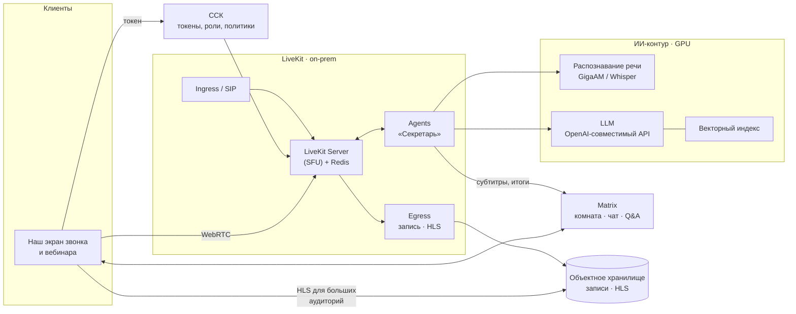

# Видеосвязь, вебинары, запись и ИИ

> Версия от 07.10.2026. Заменяет предварительную рекомендацию Jitsi: после добавления требований — большие вебинары, запись, распознавание встреч, ИИ-резюме и другие ИИ-функции — рекомендован **LiveKit**. Факты — по документации и публикациям проектов (ссылки в конце). Цифры производительности и сайзинга нужно подтвердить нагрузочным тестом в PoC.

## 1. Требования

1. Звонки 1:1 «как в Telegram»: вызов через push, системный экран звонка.
2. Видеоконсилиумы и ТМК: 3–20 участников, демонстрация вьюера, участники из других МО.
3. **Большие вебинары:** от сотен до тысяч зрителей, вопросы из зала, «вызов на сцену».
4. **Запись** встреч и вебинаров по политике.
5. **Распознавание речи:** субтитры в реальном времени и стенограмма с указанием, кто говорит.
6. **ИИ:** резюме встречи, черновик протокола консилиума, поручения; дальше — другие функции (раздел 6).
7. Всё в контуре организации (152-ФЗ, локализация), свой интерфейс в стиле продукта.

## 2. Jitsi и LiveKit: сравнение

| Критерий | Jitsi Meet | LiveKit |
|---|---|---|
| Что это | Готовое приложение видеоконференций | Платформа реального времени: медиасервер + SDK + сервисы записи, трансляций и ИИ-агентов |
| Лицензия | Apache-2.0 (Prosody — MIT) | Apache-2.0: сервер, SDK, Egress, Ingress, SIP, Agents |
| Свой интерфейс на вебе и десктопе | IFrame API: свои кнопки поверх интерфейса Jitsi | SDK и готовые компоненты: полностью свой интерфейс |
| Свой интерфейс на мобильных | Jitsi Meet SDK (внутри React Native), настраивается частично | Нативные SDK (Swift, Kotlin, а также Flutter, React Native): полностью свой экран звонка |
| Функции конференций из коробки | Лобби, модерация, «поднять руку», сессионные залы | Есть примитивы (права в токенах, серверный API модерации, атрибуты участников); сами функции — наша разработка |
| Большие встречи | Режим «зрителей» (visitors): команда Jitsi показывала 10 000 участников — это требует отдельной настройки серверов | Одна комната — один узел. Официальный тест: 10 спикеров и 3000 слушателей (аудио) на 16 ядрах. Для тысяч зрителей — трансляция HLS через Egress (раздел 4) |
| Запись | Jibri: одна запись на экземпляр, каждый — отдельная VM с Chrome | Egress: запись всей комнаты (через Chrome) или отдельных дорожек без перекодирования — сотни заданий на экземпляр. Форматы: MP4, HLS, RTMP; хранилище S3-совместимое |
| Трансляции | Jibri → RTMP | Egress → HLS / RTMP; Ingress — приём внешнего потока (RTMP, WHIP) в комнату |
| Распознавание речи | Jigasi + Skynet (Faster Whisper) или Vosk | Agents: агент получает дорожку каждого участника, ASR подключается плагином или через OpenAI-совместимый API |
| ИИ-функции | Skynet: локальные резюме встреч; остальное — своя разработка | Agents — фреймворк для ИИ-участников: субтитры, резюме, ассистенты, голосовые агенты; модели любые, в т.ч. локальные |
| Кто говорит | Jigasi транскрибирует участников раздельно; запись Jibri — смешанная | Отдельная дорожка на каждого участника: атрибуция без диаризации, и в живом режиме, и в записи |
| Телефония / ВКС | Jigasi (SIP) | SIP-сервис |
| Связь с Matrix | Через наш сервис (JWT) | То же; плюс MatrixRTC и Element Call построены на LiveKit — путь к совместимости с другими Matrix-клиентами |
| Эксплуатация | Prosody, Jicofo, Videobridge (+ Jibri на каждую запись, Jigasi) | Сервер на Go + Redis; Egress (≥ 4 ядра / 4 ГБ на экземпляр), Ingress, SIP, Agents; GPU — для ИИ |
| До первого видеоконсилиума | Быстрее | Дольше: функции конференций делаем сами (оценка — плюс 1,5–3 месяца работы команды клиентов) |

## 3. Вывод

**LiveKit универсальнее.** Jitsi — хорошее готовое приложение для совещаний, а LiveKit — платформа, на которой мы строим всё сами: звонки, консилиумы, вебинары, запись и ИИ. Для набора требований из раздела 1 это решает четыре вещи:

1. **ИИ.** Агент — полноценный участник комнаты с отдельной дорожкой каждого говорящего. Субтитры, стенограмма с атрибуцией и резюме строятся на одном механизме.
2. **Запись.** Дорожки записываются без перекодирования, сотни заданий на экземпляр. В Jitsi на каждую одновременную запись нужна отдельная VM с Chrome.
3. **Интерфейс.** Нативные SDK дают свой экран звонка и консилиума, как в макетах. Jitsi на мобильных — это «Jitsi в наших цветах».
4. **Matrix.** Звонки в экосистеме Matrix (MatrixRTC, Element Call) построены на LiveKit.

**Цена решения.** Лобби, модерацию, «поднять руку», роли вебинара и сессионные залы делаем сами из готовых примитивов LiveKit. Это дольше, чем включить Jitsi. Но видеосвязь — этап 2, и время на это в плане есть.

**Когда всё же Jitsi.** Если видеоконсилиумы нужны немедленно, без разработки, а запись и ИИ не нужны в ближайший год.

## 4. Архитектура

### 4.1. Звонки и консилиумы

- **Состояние звонка** хранится в комнате Matrix (`ru.vendor.call`). Все клиенты видят «Идёт видеоконсилиум — присоединиться», в ленте остаются начатые, завершённые и пропущенные звонки.
- **Вход — по токену LiveKit**, который выдаёт ССК только участникам комнаты Matrix. Права задаются в токене: публикация видео и аудио, демонстрация экрана, модератор. Анонимного входа нет.
- **Звонок 1:1:**
  - событие `ru.vendor.call.invite`;
  - push с высоким приоритетом (iOS — VoIP push и CallKit, Android — полноэкранное уведомление и ConnectionService);
  - принятие → оба входят в комнату LiveKit.
- **Модерация** — серверный API LiveKit через ССК: выключить микрофон, удалить участника, изменить права. Лобби — токен «только ожидание» до одобрения модератором.
- **Синхронный просмотр снимков** (этап 3): ведущий транслирует состояние вьюера (серия, срез, окно/уровень или координаты WSI) через канал данных LiveKit или события Matrix. Вьюер каждого участника повторяет его в диагностическом качестве — демонстрация экрана для диагностики не годится.

### 4.2. Вебинары

| Аудитория | Как доставляем | Задержка | Интерактив |
|---|---|---|---|
| Сцена: спикеры и модераторы (до десятков) | WebRTC, публикация | < 0,5 с | Полный |
| Зрители — до сотен, при подтверждении нагрузочным тестом до 1–3 тыс. | WebRTC в той же комнате, токен «только просмотр» | < 0,5 с | Вопросы, «поднять руку», вызов на сцену |
| Зрители — тысячи и больше | HLS: Egress пишет сегменты в объектное хранилище, раздача через nginx внутри сети, плеер в нашем клиенте | несколько секунд | Вопросы и чат — через комнату Matrix вебинара |

- **Вопросы из зала** — отдельная комната Matrix вебинара. Модераторы отбирают вопросы, ИИ группирует похожие.
- **Отчёт о присутствии**: кто и сколько смотрел (например, для НМО) — по данным подключений.
- **Запись вебинара** — те же HLS/MP4. После эфира ИИ делает оглавление и конспект.

### 4.3. Запись

- **По умолчанию выключена.** Включается политикой (консилиум, вебинар) с явным индикатором у всех участников и уведомлением при входе.
- **Два вида записи:**
  - запись всей комнаты (MP4) — для просмотра;
  - отдельные аудиодорожки участников — для стенограммы и поиска. Дорожки пишутся без перекодирования, поэтому дёшевы.
- **Хранение:** объектное хранилище в контуре, сроки хранения по политике, доступ по правам комнаты, аудит просмотров и скачиваний.

## 5. Распознавание речи и ИИ-резюме

### 5.1. Как работает «Секретарь»

1. Включили «Стенограмму» в консилиуме → ССК запускает агента LiveKit. Он входит в комнату как видимый участник «Секретарь (запись речи)».
2. Агент подписывается на аудиодорожку каждого участника и отправляет её в потоковое распознавание.
   - **Субтитры** приходят в реальном времени.
   - **Стенограмма** сразу с атрибуцией («Колесников Д. А.: …»): у каждого говорящего своя дорожка, диаризация не нужна.
3. После завершения агент отдаёт стенограмму LLM с шаблоном под тип встречи:
   - **консилиум** → черновик протокола: участники, обсуждаемый случай, мнения, решение, рекомендации;
   - **ТМК** → черновик заключения консультанта;
   - **совещание или вебинар** → резюме, решения, поручения, открытые вопросы, оглавление.
4. В чат случая приходит карточка «Итоги консилиума — черновик ИИ» с кнопками «Открыть», «Править», «Принять в протокол».
   - Принятый врачом текст уходит в МИС как черновик протокола. Подписывает врач (УКЭП).
   - Поручения становятся заявками (ИГХ, пересмотр, консультация) — каждая только после подтверждения.

### 5.2. Модели — только в контуре

| Задача | Варианты (открытые модели) | Примечание |
|---|---|---|
| Распознавание русской речи | GigaAM-v3 (Сбер, MIT по данным публикаций), Whisper large-v3 / Faster Whisper (MIT), Vosk | Медицинский словарь и дообучение на речи врачей; метрика качества — WER на собственном наборе |
| Резюме, протоколы, поручения | Модели с открытыми весами через OpenAI-совместимый сервер (vLLM и аналоги): GigaChat 3.1 Lightning (10B, MoE; MIT по данным Hugging Face), Qwen и др. | Выбор — по качеству на русских медицинских текстах в PoC; лицензию каждой модели проверить по карточке модели |
| Поиск по смыслу | Модели эмбеддингов с поддержкой русского + OpenSearch k-NN или pgvector | Выдача с учётом прав доступа к комнатам |

Внешние облачные ИИ-API не используем: 152-ФЗ, локализация и врачебная тайна.

**Ресурсы.** Распознавание и LLM требуют GPU-серверов в контуре. Для старта — 1–2 сервера. Точный сайзинг — по нагрузочному тесту: число одновременных стенограмм и длина встреч. Риск — доступность GPU и сроки поставки в РФ; стоит закладывать заранее.

## 6. Другие ИИ-функции (кандидаты)

| Функция | Где | Ценность | Этап |
|---|---|---|---|
| Расшифровка голосовых | Чаты | Ответ на ходу, поиск по голосовым | 2 |
| Живые субтитры и стенограмма | Консилиумы, вебинары | Доступность, протокол | 3 |
| Резюме встречи, черновик протокола консилиума | Консилиумы | Меньше ручного оформления | 3 |
| Конспект и оглавление записи вебинара | Вебинары | Навигация по записи | 3 |
| «Что решили» по длинному чату случая | Чат случая | Быстро войти в контекст при подключении к случаю | 3 |
| Черновик заключения ТМК из переписки и стенограммы | ТМК | Экономия времени консультанта | 4 |
| Поручения из обсуждения → черновики заявок | Чаты, консилиумы | Ничего не теряется | 4 |
| Поиск по смыслу в переписке и стенограммах | Везде | «Где обсуждали HER2-low у пациентки…» | 4 |
| Ассистент по регламентам и протоколам отделения (поиск по внутренним документам) | Бот в чате | Ответы со ссылками на документ | 4 |
| Обезличивание для учебных случаев | Избранное, обучение | Безопасное сохранение материалов | 4 |
| Проверка полноты критической находки и заявки | Карточки | Меньше уточнений | 4 |

## 7. Правила и ограничения для ИИ

- **ИИ готовит черновик, решает врач.** Результаты ИИ помечены «черновик ИИ» и не попадают в медицинские документы без подтверждения. Кто подтвердил и что изменил — в журнале.
- **Не ставим диагнозы.** Функции, которые влияют на диагностику или лечение, — это программное обеспечение как медицинское изделие: нужна регистрация (в т.ч. приказ № 193н допускает в ТМК системы поддержки решений, зарегистрированные как медицинские изделия). Резюме, стенограммы и поиск — организационные инструменты. Их статус подтвердить у юристов.
- **Уведомление и согласие.** Перед записью и распознаванием — индикатор и уведомление всем участникам. Правила для внешних участников и пациентов — по политике организации.
- **ПДн.** Стенограммы и записи содержат сведения о здоровье — для них те же меры, что для переписки: контур, права, аудит, сроки хранения.
- **Качество.** Регулярная проверка распознавания (WER на медицинской речи) и резюме (выборочная экспертная проверка). Словарь терминов и сокращений отделения.

## 8. Проверка в PoC

1. **Звонки и консилиум:** вход по токену от ССК; звонок 1:1 с вызовом через push; консилиум на 10 участников с демонстрацией вьюера.
2. **Вебинар:** 20 спикеров и 1000 зрителей WebRTC на целевом узле; параллельно HLS на 5000 эмулированных зрителей. Цели: стабильность, задержка HLS ≤ 6 с.
3. **Запись:** комната целиком (MP4) и отдельные дорожки; нагрузка на Egress.
4. **ИИ:**
   - стенограмма часового консилиума на русском с медицинской лексикой — WER на тестовом наборе, атрибуция говорящих;
   - черновик протокола — экспертная оценка 2–3 врачами;
   - время готовности итогов — ≤ 5 минут после завершения.
5. **Никаких обращений за пределы контура** — проверка сетевым мониторингом.

## 9. Источники

- Jitsi: доклад «P10K: getting 10000 participants into a Jitsi meeting», FOSDEM 2023 — <https://archive.fosdem.org/2023/schedule/event/jitsi_p10k/>
- Jibri — одна запись на экземпляр: <https://github.com/jitsi/jibri/blob/master/README.md>
- Jitsi Skynet — локальные ИИ-резюме: <https://fosdem.org/schedule/event/fosdem-2024-3591-skynet-introducing-local-ai-summaries-in-jitsi-meet>
- LiveKit: тесты производительности и ограничение «комната на одном узле» — <https://docs.livekit.io/transport/self-hosting/benchmark/>
- LiveKit Egress — <https://docs.livekit.io/transport/self-hosting/egress.md>
- LiveKit Agents — <https://docs.livekit.io/agents/overview>; Whisper через OpenAI-совместимый сервер — <https://community.livekit.io/t/installing-whisper-piper-selfhosted-help/1672>
- GigaAM-v3, лицензия MIT (публикации, ноябрь 2025) — <https://www.opensourceforu.com/2025/11/sber-open-sources-russias-most-advanced-ai-models-under-mit-licence/>
- GigaChat 3.1 Lightning — <https://huggingface.co/ai-sage/GigaChat3.1-10B-A1.8B>
